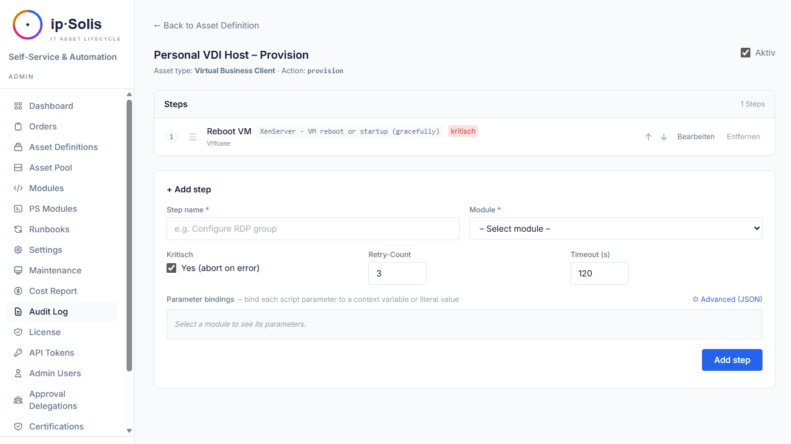
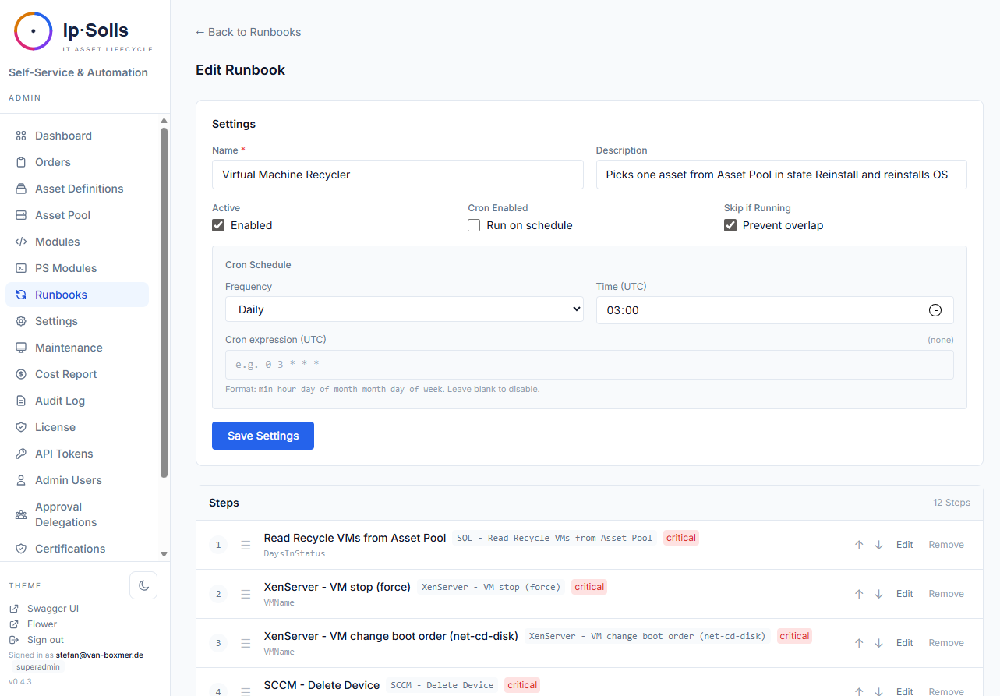

# Automation & Runbooks

ip·Solis automates IT operations through a runbook engine built on PowerShell and Celery. Runbooks define ordered sequences of steps that execute when an order is provisioned, modified, or deprovisioned. Standalone runbooks extend this to ad-hoc and scheduled operations not tied to any asset type.

---

## Automation Strategies

Each asset type is configured with one of three automation strategies that determine how provisioning and deprovisioning are executed.

### Group Access

ip·Solis adds or removes the user from one or more Active Directory or Entra ID groups. No PowerShell scripting required. Configure group targets in the asset type under **Targets**.

Each target specifies:
- **Type** — AD group, Entra ID group
- **Identifier** — the group DN or object ID
- **Principal source** — whether the user's AD account or Entra UPN is used for membership

### Runbook

A fully scripted workflow. Steps are executed in order by a Celery worker. Each step calls a named script module (a PowerShell script stored in the database) with configurable parameters.

Failures in any step abort the runbook and set the order to `failed` with the step's error output in the log.

### Composite

Combines both Group Access and Runbook steps in a defined sequence. Steps of type `GROUP_TARGETS` and `RUNBOOK` are interleaved in the order specified. Use this for workflows that need both AD group manipulation and custom PowerShell operations.

---

## Runbook Editor

Asset-type runbooks are configured in **Admin → Asset Definitions → [type] → Runbooks**.

Each runbook definition is scoped to an **action**:
- `provision` — runs when an order is approved and provisioning starts
- `modify` — runs when a user modifies an active order's attributes
- `deprovision` — runs when an order is returned, expired, or revoked

### Adding and Ordering Steps

Steps are added from the module registry. Each step specifies:
- **Module** — the script module to call
- **Parameters** — values mapped to the module's PowerShell `param()` block. Parameters can be static values or dynamic references to order attributes (e.g., `{{order.username}}`), asset attributes, or global variables

Steps can be reordered using the drag handle (`☰`) or the ↑/↓ keyboard buttons.

### Step Execution Tracking

Every step execution is recorded with:
- Start and finish timestamps
- Structured JSON output from the PowerShell script's stdout
- Error output if the step failed

The order detail page in the admin UI shows a collapsible step log for each order.

---

## Script Modules

Script modules are the building blocks of runbooks — named PowerShell scripts stored in the database and callable as runbook steps.

The in-app script editor at **Admin → Script Modules** supports:
- Writing and editing PowerShell scripts with a `param()` block
- Parameter introspection — ip·Solis parses the `param()` block to display parameter names and types
- Categorisation by prefix (e.g., `SCCM - Delete Device` → `sccm` category)
- Export to disk for git tracking (`POST /admin/seed/export`)

**Script requirements:**
- Return JSON on stdout
- Use plain ASCII (no Unicode characters)
- Not rely on interactive prompts

---

## Standalone Runbooks *(Pro)*

Standalone runbooks are not tied to any asset type. They are useful for housekeeping tasks, one-off operations, bulk user management, and scheduled maintenance jobs.

### Ad-Hoc Execution

Run a standalone runbook immediately from **Admin → Standalone Runbooks → Run**. Execution is tracked with a per-run history log, structured step output, and an optional operator note.

### Cron Scheduling

Standalone runbooks can be assigned a cron expression. The Celery Beat task `dispatch-standalone-cron` runs every minute and dispatches runbooks whose schedule has fired. Each run is recorded in the runbook's history.

The cron expression follows standard UNIX syntax (minute, hour, day-of-month, month, day-of-week). Examples:

| Expression | Meaning |
|---|---|
| `0 2 * * *` | Daily at 02:00 |
| `*/15 * * * *` | Every 15 minutes |
| `0 8 * * 1` | Every Monday at 08:00 |

---

## PowerShell Module Store

ip·Solis maintains a registry of PowerShell modules that can be loaded by script modules running in the worker container.

**Admin → Modules** lets operators:
- **Install from PowerShell Gallery** — search and install any public PS Gallery module
- **Upload a custom module** — upload a `.zip` archive (wrapped module folder)
- **Toggle Linux compatibility** — mark a module as `Linux ✓`, `Windows only ✕`, or `Unverified ?`

The worker runs PowerShell 7 on Linux. Modules tagged `PSEdition_Desktop` only won't load. The compatibility flag helps operators track which modules are safe to use in steps without an off-host Windows PowerShell remoting target.

Installed modules are stored in the `ps_modules` table and are available to all script modules.

---

## Global Variables

Global variables are key-value pairs stored in the database and injectable into runbook step parameters. They are useful for values that appear in many runbooks but may change over time — domain names, server addresses, organisation codes.

Manage global variables at **Admin → Global Variables**. Reference them in runbook step parameters as `{{var.my_variable_name}}`.

Secret-typed variables are stored encrypted and their values are never rendered in the admin UI after creation.

---

## PowerShell Execution Environment

Scripts run inside the Celery worker container (`ipsolis-worker`) using `pwsh` (PowerShell 7 on Linux). The worker handles:

- **SSL certificate bypass** — injected globally for self-signed cert environments (XenServer, vSphere, SCCM)
- **Interactive prompt suppression** — stdin is pre-answered to prevent scripts from hanging on prompts
- **Stdout capture** — the script's JSON output is parsed and stored in the step log

Scripts that call external systems (AD, vSphere, XenServer, SCCM) do so using the credentials stored in `app_config`, not via `.env`. This means credential rotation only requires an update in the admin settings — no container rebuild.

---

## Observability

- **OpenTelemetry tracing** — each Celery task produces a span linked to the originating API request trace. Traces flow to any OTLP-compatible collector (Jaeger, Tempo, SigNoz, Honeycomb)
- **Step logs** — available in the order detail page in the admin UI for every runbook execution
- **Standalone run history** — each cron or ad-hoc run records start time, finish time, per-step status, and operator notes
