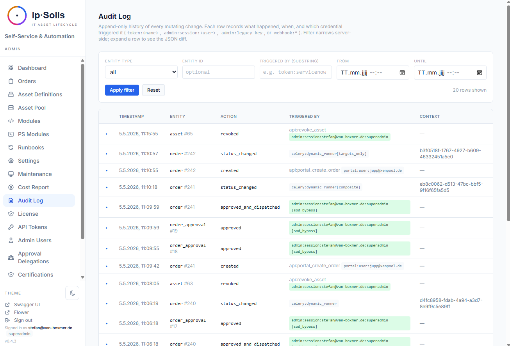

# Compliance & Audit

ip·Solis provides a tamper-evident audit trail for every operation in the system. Every mutation — order creation, approval, runbook step, configuration change — produces an append-only audit row with full attribution (who, what credential, which role). Compliance teams can query the audit log in the admin UI, export it, or stream it in real time to a SIEM.

---

## Audit Log

The `audit_log` table is the source of truth for all system activity. Each row records:

- **Entity type and ID** — what was affected (order, asset, asset type, approval, config key, etc.)
- **Action** — what happened (`created`, `updated`, `deleted`, `approved`, `revoked`, `password_changed_self`, etc.)
- **Before / after values** — a JSON diff of the change (secrets are never included)
- **Triggered by** — full attribution string identifying the credential and role
- **Timestamp** — stored in UTC

### Audit Attribution

Every audit row carries a `triggered_by` field that identifies the exact credential:

| Triggered by | Meaning |
|---|---|
| `token:<name>` | Named API token |
| `admin:session:<user>:<role>` | Admin session with role (e.g., `admin:session:alice:superadmin`) |
| `admin:legacy_key` | Legacy `X-Admin-Key` header |
| `portal:user:<email>` | Portal user (Entra ID SSO) |
| `portal:anonymous` | Portal with SSO disabled |
| `api:approval_token (approver:<email>)` | One-click approve/decline link |
| `system:auto_decline` | Automated auto-decline task |
| `system:leaver:<source>` | HR leaver flow |

This means auditors can filter not just by *who* but by *with what authority* — distinguishing an admin using an API token from the same admin using their session.

### Audit Log Viewer

The audit log UI at **Admin → Audit Log** provides:

- Filter by entity type, entity ID, triggered-by substring, and time range
- Coloured actor badges showing the credential type at a glance (token / session / legacy key / portal / webhook)
- Expandable rows showing the full before/after JSON diff
- CSV export

### Tamper Protection

PostgreSQL `BEFORE` statement triggers on the `audit_log` table block `DELETE`, `UPDATE`, and `TRUNCATE` by default. The only authorised mutation path is the retention pruning task, which uses a documented session-level escape hatch (`SET LOCAL ipsolis.allow_audit_mutation = 'true'`) that is not accessible from the application layer.

---

## Order Change Log

The `order_change_log` table captures every mutation to an order as a separate diff row — separate from the audit log to make order history easy to navigate without filtering by entity type. Visible in the admin UI's order detail page.

---

## Access Drift Reconciliation *(Pro)*

ip·Solis grants AD group membership fire-and-forget; on its own it can't tell you whether someone was added to a managed group **out of band**, or removed from one it granted. The drift reconciliation task closes that gap.

Enable **Monitor for access drift** per asset type, then set the schedule and mode under **Maintenance → Drift reconciliation**. On each run, ip·Solis re-reads the actual AD membership of every monitored group and compares it against what it provisioned (from the order change log):

- **missing access** — ip·Solis granted it, but the user is no longer in the group
- **out-of-band** — the user is in the group, but ip·Solis never granted it

Findings land on **Operations → Drift**, are audit-logged (and streamed to your SIEM), and can trigger a best-effort email / Teams alert. Two modes:

- `detect_only` — record + alert (default)
- `auto_remediate` — also re-grant missing members and revoke out-of-band ones via AD

---

## Attestation Artifacts *(Pro)*

Two ISO-27001-relevant evidence artifacts, both opt-in per asset type and delivered as **signed HTML pages** (archival via browser print — no PDF dependency):

- **Handover acknowledgment (Übergabeprotokoll)** — on provisioning, the recipient gets a signed link to confirm receipt (and an optional acceptable-use policy). The acknowledgment is persisted and audit-logged. An opt-in reminder chases overdue acknowledgments.
- **Revocation / disposal certificate** — on revoke or expiry, a signed attestation of what was removed (which groups, which instance, when) — audit evidence for offboarding / asset disposal, emitted automatically.

The signed link works without a portal login (same mechanism as the certification review link) and expires after 90 days. Review issued artifacts under **Reports → Attestations**; enable the flags on each asset definition and set the AUP text under **Settings**.

---

## Field-Level Data Classification

Asset type attributes can be tagged with a data classification:

| Class | Meaning |
|---|---|
| `internal` | Routine operational data |
| `pii` | Personally identifiable information |
| `phi` | Protected health information |
| `pci` | Payment card industry data |

The classification is **written into every audit row** at the time the order is created, based on the strictest class declared on the asset type's attributes. This snapshot is permanent — even if the asset type's classification is changed later, existing audit rows retain the original classification.

**Portal warning badges** — when a requester fills in an attribute tagged PII, PHI, or PCI, the portal renders a warning badge next to the field so they are aware of the sensitivity before submitting.

---

## SIEM Audit-Log Streaming *(Pro)*

Every `audit_log` row can be streamed in real time to an external SIEM. Configure the SIEM backend at **Admin → Settings → SIEM**.

Supported backends:

| Backend | Notes |
|---|---|
| **Splunk HEC** | HTTP Event Collector — standard Splunk token auth |
| **Microsoft Sentinel (Legacy)** | Azure Monitor Data Collector API — note: sunset by Microsoft on 2026-08-31 |
| **Microsoft Sentinel (Logs Ingestion API)** | DCE/DCR + AAD service principal — recommended for new Sentinel deployments |
| **Generic HMAC webhook** | JSON POST with `X-Hub-Signature-256: sha256=<hex>` body signing (GitHub-compatible). Configurable header name + extra headers for Datadog, Sumo Logic, Loki, Elastic, etc. |

The streamer maintains a persistent cursor so each row is forwarded exactly once. Transient failures are retried automatically. A **Send Test Event** button in the settings UI verifies connectivity before you enable streaming.

The Celery Beat task `siem-stream-audit-log` runs every minute and forwards all new rows since the last cursor position.

---

## Audit Retention Policies

A daily Beat task at 03:00 prunes audit rows past the configured retention windows. Configure retention at **Admin → Settings → Compliance → Retention**.

| Config key | Default | Description |
|---|---|---|
| `retention.audit_log_days` | — | Global window for rows without a classification |
| `retention.pii_days` | — | Window for PII-classified rows |
| `retention.phi_days` | — | Window for PHI-classified rows |
| `retention.pci_days` | — | Window for PCI-classified rows |

Classification-specific windows take precedence over the global window, so PII/PHI/PCI rows can be retained for 7+ years while routine config-change rows drop after 90 days.

The task records `last_run_at`, `last_pruned` count, and a per-class breakdown in `app_config` for operational visibility.

---

## Prometheus Metrics

ip·Solis exposes a Prometheus-compatible `/metrics` endpoint with:

- Request count and latency histogram per route
- Business gauges: orders by status, pending approvals, pool free/busy counts by asset type, Celery queue depth per worker queue

Enable with `metrics.enabled = true` in **Admin → Settings**. Route labels use path templates (not actual paths) to keep cardinality bounded.

---

## OpenTelemetry Tracing

Auto-instrumented FastAPI requests, SQLAlchemy queries, and Celery tasks produce spans exported via OTLP HTTP to any standard collector. A request that dispatches a runbook produces a single trace spanning the API and worker — making it possible to see end-to-end timing from HTTP request to runbook completion.

Configure the collector endpoint in **Admin → Settings → Observability**. A console-exporter mode is available for local verification without a running collector.
