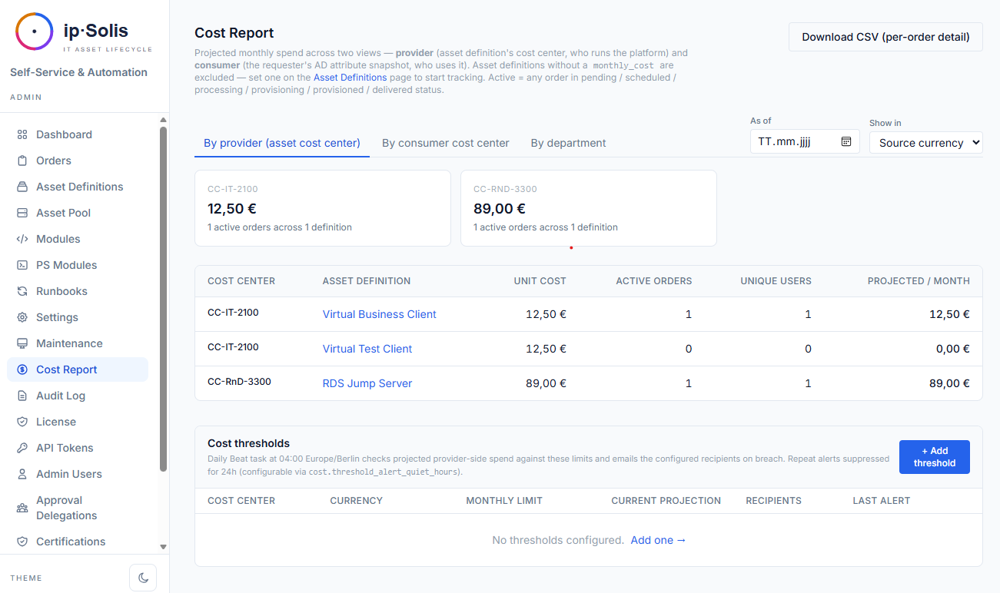

# FinOps & Kosten

ip·Solis enthält eine integrierte Engine für Kostenerfassung und Rückverrechnung (Chargeback). Jeder Asset-Typ kann mit einem Preis versehen werden, und der Kostenbericht aggregiert aktive Bestellungen zu einer prognostizierten monatlichen Ausgabe pro Kostenstelle — und liefert IT-Finanzteams genau die Daten, die sie für interne Rückverrechnung, Prognosen und Budgetdurchsetzung benötigen.

---

## Kostenmodell

Legen Sie die Kostenfelder für jeden Asset-Typ unter **Admin → Asset-Definitionen → [Typ] → Kosten** fest:

| Feld | Beschreibung |
|---|---|
| `monthly_cost` | Prognostizierte monatliche Kosten für eine Instanz dieses Asset-Typs |
| `currency` | ISO-4217-Währungscode (z. B. `EUR`, `USD`, `GBP`) |
| `cost_center` | Die Kostenstelle, die die Kosten für diesen Asset-Typ trägt |

Das Kostenmodell ist bewusst einfach gehalten: ein pauschaler Monatssatz pro Asset-Typ. Damit wird die Mehrheit der IT-Chargeback-Szenarien abgedeckt, ohne dass eine komplexe Abrechnungs-Engine erforderlich ist.

---

## Kostenbericht

Der Kostenbericht unter **Admin → Kostenbericht** aggregiert alle aktiven Bestellungen zu einer Zusammenfassung der prognostizierten monatlichen Ausgaben. Er zeigt:

- **Gesamte prognostizierte Ausgaben** pro Kostenstelle
- **Aufschlüsselung pro Anbieter** — Ausgaben nach Asset-Typ innerhalb jeder Kostenstelle
- **Aufschlüsselung nach Verbraucher** — Ausgaben aufgeschlüsselt nach Abteilung, Kostenstelle, Unternehmen und Personalnummer des Anforderers (zum Zeitpunkt der Bestellerstellung aus dem AD als Snapshot erfasst)
- **CSV-Export** — vollständige Aufschlüsselung pro Bestellung für Pivot-Auswertungen in Tabellenkalkulationen

Die Aufschlüsselung nach Verbraucher basiert auf einem AD-Attribut-Snapshot, der zum Zeitpunkt der Bestellerstellung erstellt wird. Der Snapshot erfasst `department`, `cost_center`, `company`, `employeeID` und `title` (die Attributnamen sind unter **Einstellungen → Active Directory → Verbraucherattribute** konfigurierbar). Das bedeutet, dass der Bericht widerspiegelt, wer die jeweilige Bestellung aufgegeben hat, selbst wenn sich die AD-Attribute des Benutzers später ändern.

---

## Kostenprognose pro Bestellung

Wenn für einen Asset-Typ ein `monthly_cost` konfiguriert ist, zeigt das Bestellformular des Portals die prognostizierten Gesamtkosten an, bevor der Benutzer die Bestellung absendet. Die Berechnung lautet `monthly_cost × months_requested` und erscheint in der Karte **Zugang & Dauer**. So erhalten Anforderer Einblick in die Kosten, bevor sie sich auf eine Bestellung festlegen.

---

## Software-Lizenzen & Verträge *(Pro)*

Über einen frei gesetzten `monthly_cost` pro Platz hinaus kann ip·Solis den **echten Herstellervertrag** hinter einem Asset-Typ abbilden. Ein **Vertrag** (Hersteller, Produkt, Vertragswert, Abrechnungsintervall, lizenzierte Plätze, Verlängerungsdatum, Kündigungsfrist) bindet **einen Vertrag an viele Asset-Typen**.

Ist ein Typ an einen Vertrag gebunden, bepreist der Kostenbericht jede aktive Bestellung mit dem **Pro-Platz-Satz** des Vertrags — `Vertragswert ÷ Abrechnungsintervall ÷ Plätze` — statt mit dem pauschalen `monthly_cost`. Der Verbrauch ist die Summe der aktiven Bestellungen über **alle** gebundenen Typen und liefert:

- **Auslastung** — belegte vs. lizenzierte Plätze
- **Shelfware** — ungenutzte Plätze × Platzpreis (bezahlte Kapazität, die niemand nutzt)
- **Überbelegung** — mehr aktive Bestellungen als lizenzierte Plätze (wird ausgewiesen, blockiert aber nie eine Bestellung)

Das ist *Modell A* — der tatsächliche Verbrauch wird verrechnet; ungenutzte Kapazität wird ausgewiesen, nicht auf die Verbraucher umgelegt. Verträge und Live-Auslastung finden Sie unter **Berichte → Lizenzen & Verträge**; die Bindung eines Asset-Typs an einen Vertrag erfolgt in dessen Definitionsformular.

Eine tägliche, optionale **Verlängerungserinnerung** mailt, sobald ein Vertrag sein Fenster `Verlängerungsdatum − Kündigungsfrist` erreicht — so verpassen Sie keine Kündigungsfrist.

---

## Währungsumrechnung

Wenn Asset-Typen in unterschiedlichen Währungen bepreist sind, kann der Kostenbericht alles in eine einzige kanonische Berichtswährung umrechnen.

Konfiguration unter **Admin → Einstellungen → FinOps**:

| Konfigurationsschlüssel | Beispiel | Beschreibung |
|---|---|---|
| `cost.fx.canonical` | `EUR` | Die Berichtswährung, in die alle Kosten umgerechnet werden |
| `cost.fx.rates` | `{"USD": 0.92, "GBP": 1.18}` | Statische Wechselkurse relativ zur kanonischen Währung |

Wenn die Währungsumrechnung aktiviert ist, erhält der Kostenbericht eine Währungsauswahl **Anzeigen in**, die die Zusammenfassungskarten über Kreuzkurse in eine einzige Zahl pro Kostenstelle umrechnet. Asset-Typen ohne konfigurierten Kurs werden in einem Warnbanner angezeigt, damit Betreiber wissen, welche Währungen von den Summen ausgeschlossen sind.

---

## Historische Snapshots

Ein täglicher Celery-Beat-Task (`cost-report-snapshot-daily`) um 02:00 Uhr erfasst den aktuellen Zustand aller Kostenbericht-Ansichten in der Tabelle `cost_report_snapshots`. Dies ermöglicht retrospektive Analysen — also die Beantwortung von Fragen wie „Wie hoch waren unsere prognostizierten Ausgaben im März?" —, ohne die Daten aktiver Bestellungen zu verlieren, die nur als lebendige Momentaufnahme existieren.

Die Kostenbericht-Seite erhält eine Datumsauswahl **Stand**, die für vergangene Daten aus der Snapshot-Tabelle liest. Wenn für ein ausgewähltes Datum kein Snapshot existiert (z. B. bevor Snapshots aktiviert wurden), greift der Bericht auf Live-Daten zurück.

Konfigurieren Sie die Aufbewahrungsdauer der Snapshots mit `cost.snapshot_retention_days` (Standard: 365 Tage).

---

## Kostenschwellenwert-Benachrichtigungen

Betreiber können monatliche Ausgabenobergrenzen pro `(cost_center, currency)`-Paar definieren. Wenn die prognostizierten monatlichen Ausgaben für eine Kostenstelle einen Schwellenwert überschreiten, sendet ip·Solis eine E-Mail-Benachrichtigung an die konfigurierten Empfänger.

Konfigurieren Sie Schwellenwerte auf der Kostenbericht-Seite über **Schwellenwerte verwalten**.

**Hysterese**: Die Einstellung `cost.threshold_alert_quiet_hours` (Standard: 24 Stunden) verhindert wiederholte Benachrichtigungen, wenn die Ausgaben knapp über dem Schwellenwert schwanken. Sobald eine Benachrichtigung ausgelöst wurde, wird die Uhr zurückgesetzt. Das Bearbeiten eines Schwellenwerts setzt die Benachrichtigungsuhr zurück, sodass die nächste Überschreitung sofort erneut benachrichtigt.

**Teams-Benachrichtigungen** — wenn die Microsoft-Teams-Integration aktiviert ist, werden Schwellenwert-Benachrichtigungen zusätzlich als Adaptive Card an den konfigurierten Kanal zugestellt.

**Dashboard-Indikatoren** — die Anbieter-Summenkarten der Kostenstellen im Bericht werden rot hervorgehoben, wenn sie überschritten sind, sodass die Situation auf einen Blick sichtbar ist, ohne auf eine E-Mail warten zu müssen.

Der Celery-Beat-Task `cost-threshold-alerter` läuft täglich um 04:00 Uhr (Europe/Berlin).

---

## ServiceNow-gesteuerte Bestellungen

Bestellungen, die über den ServiceNow-Webhook (`POST /webhook/servicenow`) versendet werden, durchlaufen denselben AD-Attribut-Snapshot zum Zeitpunkt der Erstellung, sodass sie in der Aufschlüsselung nach Verbraucher im Kostenbericht neben Bestellungen erscheinen, die aus dem Portal und über die API stammen. Eine separate Konfiguration ist nicht erforderlich.
