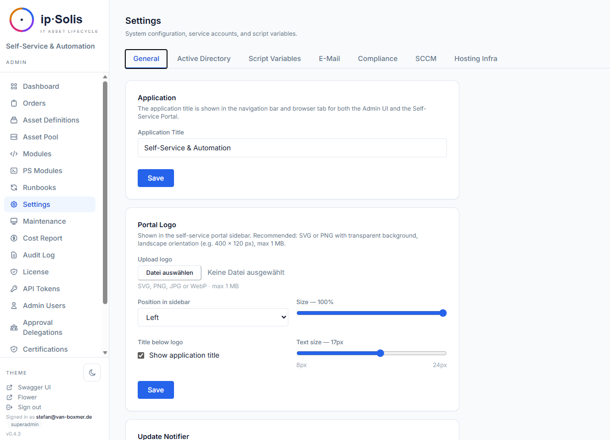
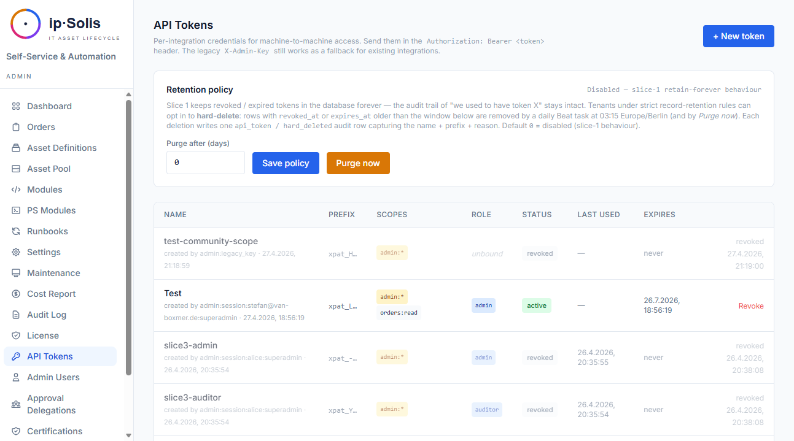

# Integrationen

ip·Solis bindet sich an Ihre bestehende Infrastruktur an, anstatt sie zu ersetzen. Sämtliche Integrations-Zugangsdaten werden zur Laufzeit über **Admin → Einstellungen** konfiguriert und in der Tabelle `app_config` gespeichert — eine Neuerstellung des Containers ist beim Ändern von Zugangsdaten nicht erforderlich.



---

## Active Directory / LDAP


Active Directory ist das Rückgrat der Benutzeridentität in ip·Solis. Es wird verwendet für:

- **Benutzervalidierung** — Bestätigung, dass das Konto eines Antragstellers existiert und aktiv ist
- **Manager-Lookup** — Ermittlung des Vorgesetzten des Antragstellers zur Genehmigungsweiterleitung
- **Gruppenmitgliedschaft** — Hinzufügen und Entfernen von Benutzern aus Gruppen als Teil von Runbook-Schritten und der Group-Access-Automatisierung
- **Prüfung berechtigter Antragsteller** — Verifizierung, dass ein Benutzer Mitglied einer eingeschränkten AD-Gruppe ist, bevor ein Antrag zugelassen wird

Konfiguration unter **Admin → Einstellungen → Active Directory**:

| Einstellung | Beschreibung |
|---|---|
| Server | LDAP-Server-Hostname oder -IP |
| Port | Standard: 389 (LDAP) oder 636 (LDAPS) |
| Bind DN / Passwort | Zugangsdaten des Dienstkontos |
| Base DN | Suchwurzel für Benutzer- und Gruppen-Lookups |
| Auth-Typ | NTLM oder Kerberos (NTLM-Signierung unterstützt) |
| Consumer-Attribute | AD-Feldnamen für `department`, `cost_center`, `company`, `employeeID`, `title` |

---

## Portal-SSO — OpenID Connect (OIDC)

Die Portal-Anmeldung nutzt standardbasiertes **OpenID Connect**. Sie registrieren einen oder mehrere Identity-Provider (jeder kompatible IdP — **Microsoft Entra ID**, Okta, Ping, Google, Keycloak, Authentik, Zitadel, …); jeder konfiguriert sich selbst aus dem Discovery-Dokument seines Issuers. Ob überhaupt ein Login erforderlich ist, steuert **Login zum Zugriff auf das Portal erforderlich** (siehe [Self-Service → Authentifizierung](./self-service#authentifizierung)).

Provider hinzufügen unter **Admin → Einstellungen → Authentifizierung → OIDC Providers**. Je Provider:

| Einstellung | Beschreibung |
|---|---|
| Provider ID | Kleinbuchstaben-Slug (`a–z0-9_-`), erscheint in der Callback-URL; nach Anlage nicht änderbar |
| Anzeigename | Erscheint in der Login-Auswahl (z. B. „Entra ID") |
| Issuer-URL | Der IdP-Issuer; Discovery wird aus `<issuer>/.well-known/openid-configuration` gelesen (Entra: `https://login.microsoftonline.com/<tenant>/v2.0`, Okta: `https://<org>.okta.com`, Google: `https://accounts.google.com`) |
| Client-ID / Secret | Aus der IdP-App-Registrierung |
| Redirect-URI | Wird aus dem Portal-Host als `/portal/auth/<provider>/callback` abgeleitet — genau diese URI in der IdP-App registrieren |
| Domänen-Allowlist | Optionale kommaseparierte UPN-/E-Mail-Domänen-Allowlist |

Verwenden Sie **Test** an einem Provider, um vor dem Speichern zu prüfen, ob dessen Discovery-Dokument erreichbar ist. On-Prem-LDAP-Anmeldung (Benutzername/Passwort) kann zusätzlich zu OIDC angeboten werden (`auth.ldap_enabled`).

---

## Entra-ID-Gruppenprovisionierung — Microsoft Graph *(Pro)*

Über die Entra-ID-*Anmeldung* (OIDC oben) hinaus kann ip·Solis Mitgliedschaft in **Entra-(Cloud-only-)Sicherheitsgruppen** als Zugriffsziel *provisionieren* — für M365-/Cloud-only-Kunden ohne On-Prem-AD. Ein Asset-Typ mit einem `entra_group`-Zugriffsziel gewährt/entzieht die Mitgliedschaft bei Bestellung und Widerruf, genau wie eine AD-Gruppe.

Konfiguration unter **Admin → Einstellungen → Compliance → Entra-Gruppenprovisionierung**:

| Einstellung | Beschreibung |
|---|---|
| Tenant-ID / Client-ID | Eine **dedizierte App-Registrierung** (getrennt von der OIDC-Anmelde-App) |
| Client-Secret | Als Secret gespeichert; Secret-Store-Referenzen werden unterstützt |

Die App-Registrierung benötigt die Anwendungsberechtigungen **`GroupMember.ReadWrite.All`** + **`User.Read.All`** (mit Admin-Zustimmung). Am Asset-Typ ist der Gruppen-`identifier` die **Objekt-ID** (GUID) der Entra-Gruppe. Grant/Revoke sind idempotent und werden im selben Order-Change-Log wie AD-Gruppen erfasst. Mit **Anmeldedaten testen** prüfen Sie den Client-Credentials-Flow.

---

## SCIM 2.0 *(Pro)*

ip·Solis stellt unter `/scim/v2/*` einen vollständigen **Joiner-/Mover-/Leaver-**SCIM-2.0-Endpunkt bereit — ein Drop-in-Provisionierungsziel für Okta, SailPoint und Ping.

**Leaver** (immer aktiv):

- `DELETE /scim/v2/Users/{id}` — löst die vollständige Leaver-Verarbeitung aus
- `PATCH` / `PUT /scim/v2/Users/{id}` mit `active=false` — löst die vollständige Leaver-Verarbeitung aus

**Joiner** (Opt-in, `scim.joiner_enabled`): Ein SCIM-**Create** (`POST /Users`) — oder eine Reaktivierung — mappt die SCIM-Attribute des Benutzers (Core + Enterprise-Extension: `department`, `costCenter`, `employeeNumber`, `organization`, `title`) auf ip·Solis-Attribute, wertet Ihre [Zuweisungsregeln](./lifecycle#onboarding-bundles-pro) aus und bestellt die passenden [Bundles](./lifecycle#onboarding-bundles-pro). Idempotent — bereits vorhandene Asset-Typen werden übersprungen.

**Mover** (`scim.mover_mode`): Bei einer Attribut-Änderung (`PUT`-Replace oder `PATCH`) wertet ip·Solis die Regeln gegen die neuen Attribute neu aus und gleicht die Berechtigungen ab:

- `disabled` — Attribut-Änderungen werden ignoriert
- `additions_only` — neu berechtigte Bundles bestellen; nie widerrufen
- `reconcile` — Additions **plus** Widerruf von Berechtigungen, die nicht mehr passen

Der Auto-Revoke ist strikt auf **regel-/SCIM-provisionierte** Zugriffe beschränkt; Self-Service- und manuell erstellte Bestellungen werden nie automatisch widerrufen. Da ip·Solis keinen lokalen Benutzerspeicher hat, nutzt das Mover-Diffing eine minimale Last-Seen-**Identitätsprojektion** (`scim_identities`), die bei jedem SCIM-Write gepflegt wird.

**Listenfilter**: `GET /Users?filter=` unterstützt die vollständige Grammatik nach RFC 7644 §3.4.2.2 — Vergleichsoperatoren `eq ne co sw ew gt ge lt le`, Präsenz `pr`, logisch `and` / `or` / `not` und geklammerte Gruppierung. Ein fehlerhafter Filter liefert `400 invalidFilter`.

**Gruppen**: `/Groups` ist ein Read-Only-Shim (leere Liste) — ip·Solis modelliert Gruppen-Mitgliedschaft im Active Directory, nicht in SCIM.

**Authentifizierung**: Erstellen Sie unter **Admin → API-Token** ein Token mit den Scopes `scim:read` + `scim:write` und fügen Sie es in den IdP-Konnektor ein. Joiner / Mover aktivieren Sie unter **Einstellungen → Compliance → SCIM**.

Siehe [Lifecycle & Asset-Pool → HR-Leaver-Flow](./lifecycle#hr-leaver-flow) für das Leaver-Verhalten und [Onboarding-Bundles](./lifecycle#onboarding-bundles-pro) für die Regel-Engine.

---

## HR-Leaver-Webhook *(Pro)*

Ein speziell entwickelter Webhook unter `POST /hr/leaver` für HR-Systeme, die Kündigungsereignisse übermitteln. Nativ unterstützt für Workday, SAP SuccessFactors, Microsoft Graph sowie ein generisches ip·Solis-eigenes Format.

**Authentifizierung**: gescopetes API-Token (Scope `hr:leaver`) oder HMAC-SHA256-Body-Signierung mit `WEBHOOK_SECRET_TOKEN`.

Siehe [Lifecycle & Asset-Pool → HR-Leaver-Flow](./lifecycle#hr-leaver-flow) für Payload-Formate und die vollständige Dokumentation.

---

## ServiceNow-Webhook *(Pro)*

ip·Solis kann Bestellauslöse-Anfragen von ServiceNow (oder jedem HTTP-fähigen Workflow-Tool) über einen eingehenden Webhook unter `POST /webhook/servicenow` empfangen. Der Webhook erstellt eine Bestellung und löst sofort das passende Runbook aus — von ServiceNow ausgehende Bestellungen durchlaufen dieselben Genehmigungs-Workflows, Kapazitätsprüfungen, Runbooks und denselben Audit-Trail wie Portal-Bestellungen.

### Authentifizierung

Es werden zwei Authentifizierungswege unterstützt. Beide sind für sich ausreichend; beide können koexistieren.

**Bearer-Token (empfohlen für neue Integrationen)**

Erstellen Sie unter **Admin → API-Token** ein benanntes API-Token mit dem Scope `webhook:in`. Übergeben Sie es im `Authorization`-Header:

```
Authorization: Bearer xpat_…
```

Bearer-Token sind einzeln über die Admin-UI widerrufbar, ohne den laufenden Container anzufassen oder ein gemeinsames Secret zu rotieren.

**HMAC-SHA256-Signatur (Legacy / Abwärtskompatibilität)**

Konfigurieren Sie ein gemeinsames Secret unter **Admin → Einstellungen → ServiceNow** (Umgebungsvariable `WEBHOOK_SECRET_TOKEN`). Signieren Sie den rohen Request-Body mit HMAC-SHA256 und senden Sie das Ergebnis als:

```
X-Hub-Signature-256: sha256=<hex-digest>
```

Dies ist das GitHub-kompatible Body-Signierungsformat. Sind beide Header vorhanden, hat Bearer Vorrang.

---

### Request-Format

**Endpunkt:** `POST /webhook/servicenow`  
**Content-Type:** `application/json`

#### Payload-Felder

| Feld | Typ | Erforderlich | Beschreibung |
|---|---|---|---|
| `servicenow_ref` | string | ✓ | ServiceNow-RITM-Nummer (z. B. `RITM0012345`). Wird als Idempotenzschlüssel verwendet — ein zweiter POST mit demselben Wert gibt `409 Conflict` zurück. |
| `snow_req` | string | — | ServiceNow-REQ-Nummer (z. B. `REQ0009876`). Wird zur Querverweisbildung im Bestelldetail und im Audit-Log gespeichert. |
| `action` | string | ✓ | `"provision"` oder `"delete"`. Bestimmt, welches Runbook ausgelöst wird. |
| `user_email` | string (E-Mail) | ✓ | E-Mail-Adresse des Benutzers, dem das Asset zugewiesen wird. |
| `user_name` | string | ✓ | Anzeigename des Benutzers (verwendet in Benachrichtigungen und der Bestell-UI). |
| `owner_email` | string (E-Mail) | — | Falls das Asset einen abweichenden Eigentümer hat (z. B. im Auftrag einer anderen Person bestellt), dessen E-Mail. Standardwert ist `user_email`, falls weggelassen. |
| `owner_name` | string | — | Anzeigename des Eigentümers. |
| `asset_type_name` | string | ✓ | Exakter Name des Asset-Typs, wie in ip·Solis konfiguriert (z. B. `"Standard VDI"`). Gibt `400` zurück, wenn nicht gefunden. |
| `requested_from` | ISO-8601-Datumzeit | ✓ | Beginn des Zuweisungszeitraums (z. B. `"2026-06-13T00:00:00Z"`). |
| `requested_until` | ISO-8601-Datumzeit | ✓ | Ende des Zuweisungszeitraums / Ablaufdatum. |
| `rdp_users` | Array von Strings | — | Zusätzliche RDP-Benutzer, denen Zugriff gewährt wird. Gilt nur für Asset-Typen mit aktiviertem `allow_user_lists`. |
| `admin_users` | Array von Strings | — | Zusätzliche Admin-Benutzer, denen Zugriff gewährt wird. Gleiche Einschränkung wie `rdp_users`. |
| `config` | object | — | Freiform-Key/Value-Map für benutzerdefinierte Asset-Attribute, die am Asset-Typ definiert sind. Schlüssel müssen mit dem Attributfeld `key` der Asset-Definition übereinstimmen. Werte werden als `config`-JSON der Bestellung gespeichert und sind in Runbook-Schritten als Kontextvariablen `$PARAMS.attr_<key>` zugänglich. |

#### Beispiel-Request

```bash
curl -X POST https://ipsolis.example.com/webhook/servicenow \
  -H "Authorization: Bearer xpat_abc123..." \
  -H "Content-Type: application/json" \
  -d '{
    "servicenow_ref": "RITM0012345",
    "snow_req": "REQ0009876",
    "action": "provision",
    "user_email": "jane.doe@example.com",
    "user_name": "Jane Doe",
    "asset_type_name": "Standard VDI",
    "requested_from": "2026-06-13T00:00:00Z",
    "requested_until": "2026-07-13T00:00:00Z",
    "config": {
      "project_code": "EU-FINANCE-2026",
      "cost_center": "CC-4400"
    }
  }'
```

---

### Response

Bei Erfolg gibt der Endpunkt `201 Created` mit der neu erstellten Bestellung als JSON zurück:

```json
{
  "id": 312,
  "servicenow_ref": "RITM0012345",
  "snow_req": "REQ0009876",
  "action": "provision",
  "status": "processing",
  "user_email": "jane.doe@example.com",
  "user_name": "Jane Doe",
  "owner_email": null,
  "owner_name": null,
  "asset_type_id": 3,
  "assigned_asset_id": null,
  "rdp_users": [],
  "admin_users": [],
  "requested_from": "2026-06-13T00:00:00Z",
  "requested_until": "2026-07-13T00:00:00Z",
  "celery_task_id": "a3f2c1d0-84e7-4b91-bc2e-9f1a0e5d3c88",
  "config": {
    "project_code": "EU-FINANCE-2026",
    "cost_center": "CC-4400"
  },
  "error_message": null,
  "created_at": "2026-06-13T21:07:00Z",
  "updated_at": "2026-06-13T21:07:01Z",
  "steps": []
}
```

Bemerkenswerte Felder in der Response:

| Feld | Hinweise |
|---|---|
| `id` | ip·Solis-Bestell-ID — verwenden Sie diese, um den Bestellstatus über `GET /orders/{id}` abzufragen |
| `status` | `"processing"` nach dem Auslösen; `"pending_approval"`, wenn der Asset-Typ eine Genehmigung erfordert, bevor das Runbook läuft |
| `assigned_asset_id` | `null` zum Erstellungszeitpunkt bei `capacity_pooled`-Typen — wird vom Runbook befüllt, sobald ein Asset zugewiesen ist |
| `celery_task_id` | Celery-Task-UUID — in Flower zur Fehlersuche sichtbar |
| `steps` | Leer bei Erstellung; wird während der Runbook-Ausführung befüllt |

Die Bestellung ist bereits an den Worker ausgeliefert, wenn die Response eintrifft.

---

### Kapazitäts- und Kontingentprüfungen

Bei `action: provision` erzwingt ip·Solis dieselben Vorabprüfungen wie bei Portal-Bestellungen, bevor irgendetwas erstellt wird:

- **Pool-Kapazität** — wenn der Asset-Typ `capacity_pooled` ist und ein Pool-Größenlimit hat, wird die Anfrage mit `429` abgelehnt, sobald keine Kapazität verfügbar ist.
- **Kontingent pro Benutzer** — wenn `max_per_user` am Asset-Typ gesetzt ist, wird die Anfrage mit `429` abgelehnt, falls der Benutzer bereits so viele aktive Instanzen hält.

---

### Idempotenz

`servicenow_ref` ist ein eindeutiger Schlüssel. Das erneute Einreichen derselben RITM-Nummer gibt zurück:

```
HTTP 409 Conflict
{"detail": "Order with servicenow_ref 'RITM0012345' already exists"}
```

Dies ermöglicht ServiceNow, eine fehlgeschlagene Webhook-Zustellung gefahrlos erneut zu versuchen, ohne doppelte Bestellungen zu erzeugen.

---

### Fehlerreferenz

| Status | Ursache |
|---|---|
| `400 Bad Request` | `asset_type_name` in ip·Solis nicht gefunden |
| `401 Unauthorized` | Fehlende oder ungültige Authentifizierung (kein Bearer-Token und keine gültige HMAC-Signatur) |
| `403 Forbidden` | Bearer-Token vorhanden, aber ohne Scope `webhook:in` |
| `409 Conflict` | `servicenow_ref` existiert bereits (doppelte Zustellung) |
| `422 Unprocessable Entity` | Payload-Validierungsfehler (fehlendes Pflichtfeld, ungültige E-Mail usw.) |
| `429 Too Many Requests` | Pool-Kapazität oder Kontingent pro Benutzer überschritten |

---

### Audit-Trail

Jede per Webhook erstellte Bestellung erscheint unter **Admin → Audit-Log** mit `triggered_by` gesetzt auf entweder `webhook:token:<token-name>` (Bearer-Pfad) oder `webhook:hmac` (HMAC-Pfad), wodurch ServiceNow-gesteuerte Bestellungen auf einen Blick von Portal- und API-Bestellungen unterschieden werden können.

---

## VMware vSphere

vSphere-VM-Lebenszyklusoperationen werden über PowerCLI-Skripte ausgeführt, die im Skriptmodul-Speicher abgelegt sind (Kategorie: `vmware`). Der Worker-Container führt `pwsh` (PowerShell 7 unter Linux) mit vorkonfiguriertem SSL-Zertifikats-Bypass für selbstsignierte vCenter-Zertifikate aus.

Konfiguration unter **Admin → Einstellungen → VMware vSphere**:

| Einstellung | Beschreibung |
|---|---|
| vCenter-Server | Hostname oder IP |
| Benutzername / Passwort | Dienstkonto mit VM-Verwaltungsberechtigungen |

vSphere-Operationen (Ein-/Ausschalten, Klonen, Löschen, Rekonfigurieren) sind als Skriptmodule implementiert, die aus Runbook-Schritten heraus aufgerufen werden. Fügen Sie diese Skripte den Runbooks Ihres Asset-Typs unter **Admin → Asset-Definitionen → Runbooks** hinzu.

---

## XenServer / XCP-ng

XenServer- und XCP-ng-VM-Lebenszyklusoperationen folgen demselben Muster wie vSphere — PowerShell-Skripte, die als Skriptmodule abgelegt sind (Kategorie: `xenserver`) und über `pwsh` im Worker-Container ausgeführt werden.

Konfiguration unter **Admin → Einstellungen → XenServer/XCP-ng**:

| Einstellung | Beschreibung |
|---|---|
| XenServer-Host | Hostname oder IP des Pool-Masters |
| Benutzername / Passwort | XenAPI-Zugangsdaten |

SSL-Zertifikatsabfragen werden über stdin-Injektion automatisch beantwortet, sodass Skripte bei nicht vertrauenswürdigen Zertifikaten nicht hängenbleiben.

---

## SCCM *(Pro)*

Die SCCM-Integration ermöglicht automatisierte OS-Deployment-Workflows:

- **Task-Sequence-Trigger** — Starten einer SCCM-Task-Sequence für ein bestimmtes Gerät
- **Geräteanlage (in SCCM)** — Anlegen eines Computerdatensatzes *in* SCCM über die AdminService-REST-API (Kerberos-Authentifizierung). Dies ist ein ausgehender Schreibvorgang während der Provisionierung; ip·Solis liest/importiert derzeit **keine** bestehenden Geräte *aus* einer SCCM-Collection in den Asset-Pool.
- **Gerätelöschung** — Entfernen eines Computerdatensatzes nach der Außerbetriebnahme
- **Status-Polling** — der Celery-Workflow `sccm_probe` fragt SCCM nach dem Abschlussstatus der Task-Sequence ab und versetzt den Bestellstatus entsprechend weiter

Konfiguration unter **Admin → Einstellungen → SCCM**:

| Einstellung | Beschreibung |
|---|---|
| SCCM-Server | Hostname des Site-Servers |
| AdminService-URL | `https://<server>/AdminService/v1.0` |
| Kerberos-Principal | UPN des Dienstkontos |
| Kerberos-Passwort | Passwort des Dienstkontos |

---

## SMTP


Alle transaktionalen E-Mails (Genehmigungsbenachrichtigungen, Erinnerungen, Ablaufwarnungen, Leaver-Benachrichtigungen, Health-Alerts) werden über Pythons `smtplib` versendet.

Konfiguration unter **Admin → Einstellungen → SMTP**:

| Einstellung | Beschreibung |
|---|---|
| Host / Port | SMTP-Serveradresse und -Port |
| Benutzername / Passwort | SMTP-Authentifizierungs-Zugangsdaten |
| From-Adresse | In E-Mails angezeigte Absenderadresse |
| TLS-Modus | STARTTLS oder SSL/TLS |
| Reply-to | Optionale Reply-to-Adresse für Genehmigungs-E-Mails |

Verwenden Sie **Test-E-Mail senden**, um die Verbindung vor dem Speichern zu verifizieren.

### Authentifizierungs-Optionen

ip·Solis spricht reines SMTP (STARTTLS/SSL + Benutzername/Passwort). Das ist bewusst
provider-agnostisch — es funktioniert mit jedem Mailsystem, nicht nur mit Microsoft oder
Google — sodass Sie unabhängig von Ihrem Identity-Provider nur **eine** SMTP-Konfiguration
pflegen. ip·Solis nutzt **keine** herstellerspezifischen Versand-APIs (z. B. Microsoft Graph),
die einen zweiten, nur für Microsoft gültigen Konfigurationspfad bedeuten würden.

Wie Sie sich authentifizieren, hängt von Ihrer Mailplattform ab:

| Szenario | Empfohlenes Vorgehen |
|---|---|
| Dedizierter/interner SMTP-Server oder ein Mail-Relay (SES, SendGrid, Mailgun, interner Postfix-/Exchange-Smarthost) | Benutzername + API-Key/Passwort des Relays direkt verwenden. **Empfohlen** — das Relay übernimmt die provider-spezifische Auth, ip·Solis behält eine einfache SMTP-Konfiguration. |
| Microsoft 365 mit aktivierter MFA | Ein **App-Kennwort** für ein dediziertes Service-Postfach erstellen und als SMTP-Passwort verwenden. Funktioniert heute, beachten Sie aber den Hinweis unten. |
| Google Workspace mit Bestätigung in zwei Schritten | Ein **App-Kennwort** für ein dediziertes Service-Konto erstellen und als SMTP-Passwort verwenden. |

> **Hinweis zu Microsoft 365:** App-Kennwörter setzen das legacy per-user MFA voraus und sind
> bei aktivierten *Security Defaults* nicht verfügbar; zudem baut Microsoft Basic Auth für SMTP
> schrittweise ab. Für ein zukunftssicheres M365-Setup richten Sie ip·Solis auf ein
> **SMTP-Relay / einen Mail-Connector** aus (Option 1 oben), statt sich direkt mit einem
> App-Kennwort gegen `smtp-mail.outlook.com` zu verbinden. So bleibt ip·Solis auf einem
> provider-agnostischen SMTP-Pfad, und die M365-spezifische Auth liegt beim Relay, wo sie hingehört.

Token-basiertes SMTP (`XOAUTH2`) und herstellerspezifische Versand-APIs sind bewusst nicht
implementiert: Sie erfordern provider-spezifische Token-Verarbeitung und eine zweite
Konfigurationsfläche — bei geringem Mehrwert gegenüber einem Relay.

---

## Chat-Benachrichtigungen — Microsoft Teams & Slack *(Pro)*

Genehmigungsanfragen (und Erinnerungen) können parallel zur E-Mail an **Microsoft Teams** und/oder **Slack** gesendet werden. Beide tragen denselben kanal-agnostischen **Ein-Klick-Genehmigungslink** (ein signiertes Token — der Genehmiger entscheidet ohne Portal-Login), sodass eine Anfrage gleichzeitig per E-Mail, Teams und Slack ankommen kann.

| Kanal | Einstellung | Zustellung |
|---|---|---|
| Teams | `teams.mode` + Workflows-Webhook-URL | Adaptive Card (mit @Mention des Genehmigers, damit Teams eine echte Benachrichtigung auslöst) |
| Slack | `slack.mode` + Incoming-Webhook-URL | Block-Kit-Nachricht |

Beide konfigurieren Sie unter **Admin → Einstellungen** (Teams- und Slack-Karten), jeweils mit einem **Test-senden**-Button. Sie laufen unabhängig — das Aktivieren von Slack beeinflusst Teams nicht, und keiner ersetzt die E-Mail. Dieselben Kanäle tragen auch Zertifizierungs- und Kostenschwellen-Benachrichtigungen.

---

## Externe Secret-Backends

Ersetzen Sie Klartext-Zugangsdaten in `app_config` durch Referenzen auf einen externen Secret-Manager. ip·Solis löst Referenzen beim Lesen auf, mit einem prozesslokalen Cache mit 60-Sekunden-TTL.

Die Auflösung ist **opt-in pro Zugangsdatum**: ein als Klartext eingetragener Wert bleibt Klartext; nur als Referenz gespeicherte Werte werden aufgelöst. Sie gilt für jedes zur Laufzeit gelesene Integrations-Credential — Active Directory, SMTP, SCCM, OIDC sowie die Teams-/Slack-Webhooks. Sie gilt **nicht** für Admin-Login-Konten: deren Passwörter liegen als Einweg-Hash vor (nie im Klartext), es gibt also nichts zu externalisieren.

Unterstützte Backends:

| Backend | Referenzformat |
|---|---|
| HashiCorp Vault | `vault://<path>[#<field>]` |
| CyberArk CCP/AIM | `ccp://[<safe>/]<object>` |
| Azure Key Vault | `azurekv://<vault>/<secret>` |
| AWS Secrets Manager | `awssm://<secret-id>[#<field>]` |
| CyberArk Conjur | `conjur://<identifier>[#<field>]` |

Reine String-Werte funktionieren unverändert weiter, sodass Sie eine Zugangsdaten-Referenz nach der anderen migrieren können.

**Vault-Authentifizierung**: statisches Token, AppRole (role_id + secret_id) oder Kubernetes-JWT.

**Azure-KV-Authentifizierung**: Azure-AD-Service-Principal (unabhängig von der Entra-ID-SSO-Konfiguration).

**AWS-Authentifizierung**: statische IAM-Schlüssel oder natives `sts:AssumeRole` mit automatischer Session-Erneuerung.

**Bulk-Migrationstool**: **Einstellungen → Compliance → Externes Secret-Backend → Klartext-Secrets ins Backend migrieren** durchläuft alle Zeilen mit `is_secret=true`, überträgt die Klartextwerte an das aktive Backend und ersetzt sie durch Referenzen. Enthält eine Dry-Run-Vorschau und einen zeilenweisen Bericht.

---

## API-Token

Pro-Integration benannte API-Token ersetzen den einzelnen gemeinsamen `X-Admin-Key` durch individuell widerrufbare, ablaufende, gescopete Bearer-Token.



Token werden als SHA-256-Hashes gespeichert. Das rohe Token (`xpat_…`) wird bei der Erstellung einmalig angezeigt und kann nicht wiederhergestellt werden — behandeln Sie es wie ein Passwort.

### Scopes

| Scope | Zugriff |
|---|---|
| `admin:*` | Vollständiger Admin-API-Zugriff |
| `admin:read` | Nur-Lese-Admin-Zugriff |
| `orders:write` | Bestellungen über die REST-API erstellen |
| `webhook:in` | Den eingehenden ServiceNow-Webhook aufrufen (`POST /webhook/servicenow`) |
| `hr:leaver` | Den HR-Leaver-Webhook aufrufen |
| `scim:read` | SCIM-GET-Operationen |
| `scim:write` | SCIM POST/PUT/PATCH/DELETE (löst Leaver-Flow aus) |

### Rollenbindung

Token können mit einer bestimmten Rolle ausgegeben werden (`superadmin`, `admin`, `approver`, `auditor`, `helpdesk`). Rollengeschützte Routen erzwingen sowohl Scope als auch Rolle. Ein Ersteller kann nur Token bis zu seiner eigenen Rolle ausgeben — keine Rechteausweitung.

### Hard-Delete-Aufbewahrung

Eine optionale tägliche Aufgabe (`api-token-purge-daily`) löscht Token endgültig (Hard-Delete), deren `revoked_at` oder `expires_at` älter ist als `api_tokens.purge_after_days`. Standard ist `0` (unbegrenzt aufbewahren). Jeder Hard-Delete erzeugt eine Audit-Zeile.

### Legacy-`X-Admin-Key`

Der ursprüngliche `X-Admin-Key`-Header funktioniert weiterhin als virtuelle Superadmin-Zugangsdaten, sodass bestehende Integrationen beim Upgrade nicht abbrechen. Es wird empfohlen, für neue Integrationen auf benannte API-Token zu migrieren.
