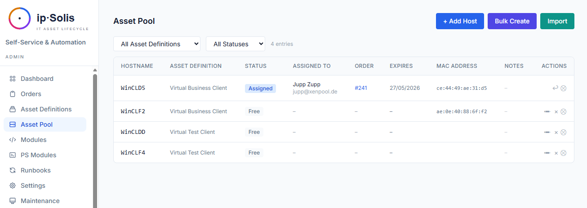
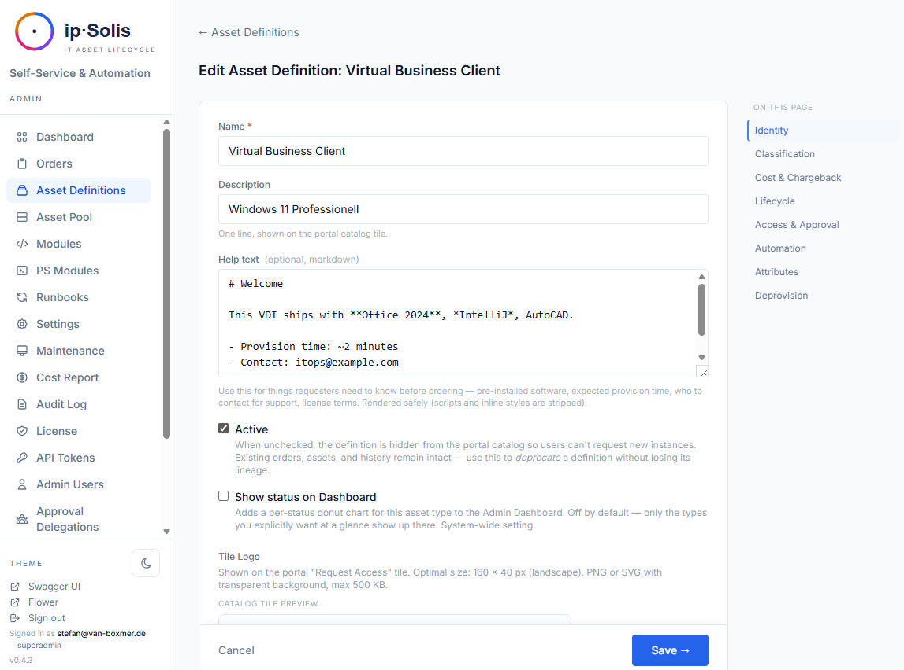
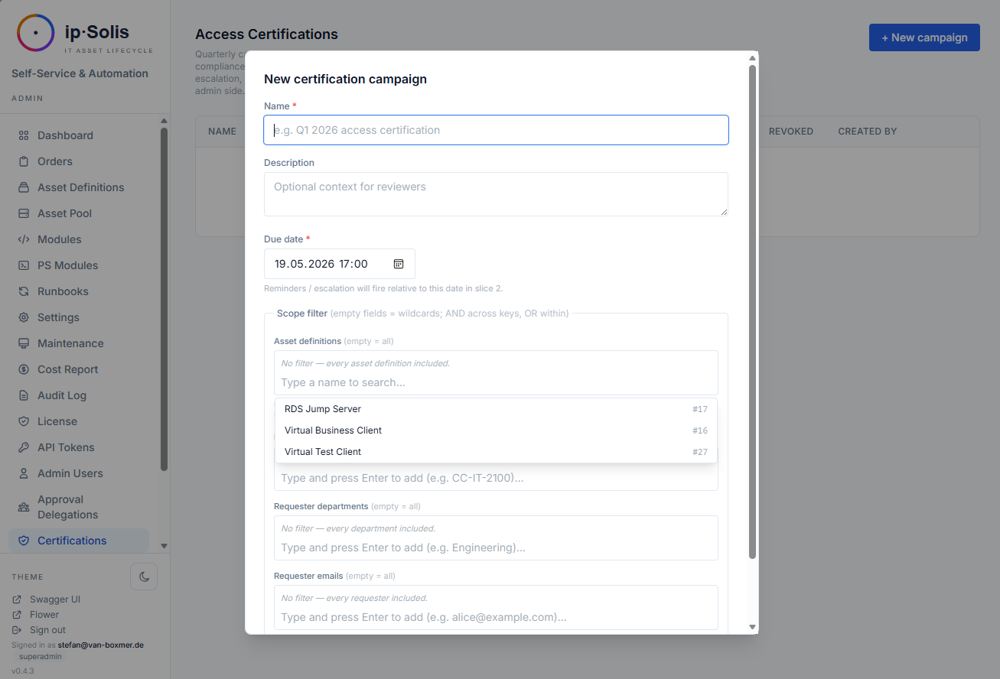

# Lifecycle & Asset Pool

ip·Solis manages the full lifecycle of IT assets — from initial assignment through expiry, extension, return, deprovisioning, and leaver revocation. This page covers the data model and configuration options that govern how assets move through their states.

---

## Assignment Models

Every asset type is configured with one of two assignment models that determine how assets are allocated.

### Capacity-Pooled

A shared pool of fungible assets. When a user requests one, ip·Solis picks an available asset from the pool, assigns it, and tracks the assignment for the lifetime of the order. On return, the asset goes back into the pool.

Typical use: virtual desktops, VPN accounts, shared servers.

**Per-user quota** (`max_per_user`) — optionally limits how many instances a single user can hold simultaneously. Counted across all non-terminal order states.

### Assigned-Personal

A 1:1 asset-to-user relationship with no shared pool. Each order creates or manages a dedicated asset for that specific user.

Typical use: physical workstations, personally assigned licenses.

---

## Asset Statuses

| Status | Meaning |
|---|---|
| `Free` | Available in the pool, ready for assignment |
| `reserved` | Held by a scheduled order — not yet active, but unavailable to other requesters |
| `busy` | Actively assigned to a user |
| `Reinstall` | Queued for reinstall after return-to-pool-reinstall deprovision |
| `Reinstalling` | Reinstall runbook currently executing |
| `Failed` | Reinstall runbook failed — manual intervention required |
| `maintenance` | Taken offline by an operator |

The admin dashboard shows tile counts for Free / In Use / Failed / Reinstall / Maintenance / Total, updated via live HTMX fragments. (The asset pool list labels the same state "Assigned" — both refer to the underlying `busy` status.)

---

## Asset Type Configuration

Asset types are defined in **Admin → Asset Definitions**.

Key fields:

| Field | Description |
|---|---|
| **Category** | Groups asset types in the portal catalog |
| **Assignment model** | Capacity-pooled or assigned-personal |
| **Automation strategy** | Group Access, Runbook, or Composite — see [Automation & Runbooks](./automation) |
| **Deprovision policy** | What happens when an asset is returned or expired |
| **Pool capacity** | Maximum pool size; capacity warnings appear on the dashboard at ≥80% / ≥95% fill |
| **Lifecycle renewable** | Whether users can request extensions |
| **Eligible requestors** | AD group restriction — only members can see and request this type |
| **Max per user** | Per-user quota (pooled and personal models) |
| **Active / inactive** | Inactive types disappear from the portal but historical orders remain intact |

---

## Deprovision Policies

The deprovision policy controls what ip·Solis does when an order is returned, expired, or cancelled.

| Policy | What happens |
|---|---|
| `access_only` | Removes user access (AD groups, etc.) but leaves the asset in its current state |
| `return_to_pool` | Removes access and marks the asset as `Free` in the pool |
| `return_to_pool_reinstall` | Removes access, marks as `Reinstall`, then runs the reinstall runbook before returning to `Free` |
| `deallocate` | Removes access and deallocates the underlying resource (e.g., powers off a VM) |
| `delete` | Removes access and deletes the underlying resource permanently |
| `custom_runbook` | Runs a fully custom deprovision runbook defined per asset type |

---

## Expiry and Renewal

Every provisioned order has an expiry date. A Celery Beat task (`check-expiring-assets`) runs hourly to:

1. Send reminder emails to users whose assets expire within the configured warning window
2. Automatically trigger deprovision for assets past their expiry date

Users can request an extension from the **My IT** portal page if the asset type has `lifecycle_renewable` enabled. Extensions are subject to the same approval rules as new orders.

---

## Access Certification Campaigns

Certification campaigns let compliance teams periodically review which users have active access to specific asset types — a requirement for ISO 27001, SOX, and PCI audits.

### Creating a Campaign

In **Admin → Certifications**, create a campaign with:

- **Scope** — filter by asset types, cost centers, departments, or specific requester emails
- **Due date** — when reviews must be completed
- **Escalation contacts** — who to notify if reviews are overdue
- **Auto-revoke on overdue** — opt-in: unreviewed access is automatically pulled after the due date

### Review Flow

When a campaign is started, ip·Solis materialises one review row per (matching order, reviewer = the order's manager). Reviewers receive a kickoff email with a signed-token URL that opens a no-login review queue. From there they choose:

- **Confirm** — the user keeps access; the review is closed
- **Revoke** — ip·Solis immediately triggers the deprovision runbook for that order

### Automated Reminders

A daily Beat task sends reminder emails at configurable offsets before the due date (default: 7 days and 1 day before), an overdue notification after the deadline, and a summary to escalation contacts. Auto-revoke, when enabled, fires for all unreviewed rows past the due date.

### Portal Review Queue

Reviewers with Entra ID SSO can also access their review queue at `/portal/certifications` — no separate admin account required.

---

## Onboarding Bundles *(Pro)*

A **bundle** groups existing asset definitions into a package — a new hire's standard kit (laptop, VDI, M365 groups, …) ordered as a unit. Bundles define no new assets; each **position** references an asset type (required or optional, with an optional attribute pre-fill).

An **assignment rule** maps user attributes (department, cost center, title, …) to a bundle, reusing the same AND/OR/NOT condition editor as the conditional approval rules. There is no local user store, so rule evaluation is a pure function over an attribute dictionary — resolved from AD, supplied via SCIM, or entered manually.

Ordering a bundle creates **one order group** with one order per resolvable position, through the normal approval and execution paths — so per-item approval, capacity, runbooks, and audit all work unchanged. It is **idempotent**: an asset type the user already actively holds is skipped. A bundle can be triggered from:

- **Onboarding** admin — *evaluate for a user* (resolve their attributes, preview the matched bundles + which items would be ordered), then order
- the self-service **Packages** catalog — a user orders a package for themselves
- a **SCIM joiner** (see [Integrations → SCIM](./integrations#scim-20-pro))
- a user's **first portal login** (opt-in, `onboarding.eval_on_first_login`)

Manage bundles and rules under **Onboarding**.

> **Design note:** ip·Solis deliberately did *not* invert its order model into a mandatory header. A single order stays exactly as before (no group); a lightweight `order_group` header exists only for multi-item requests — so bundles add capability without touching the proven single-order path.

---

## HR Leaver Flow

When a user leaves the organisation, ip·Solis automatically revokes all their active access. The leaver flow is triggered by one of two entry points:

- **HR webhook** at `POST /hr/leaver` — purpose-built for Workday, SAP SuccessFactors, Microsoft Graph, and custom HR systems
- **SCIM 2.0** at `/scim/v2/*` — a leaver-focused subset of RFC 7644, compatible with Okta, SailPoint, and Ping deprovisioning connectors

Both paths run the same `process_leaver()` logic:

1. Every active order (pending, pending-approval, scheduled, processing, provisioning, provisioned, delivered) is set to REVOKING and its deprovision runbook is dispatched
2. Pending approvals where the leaver was the approver are marked **superseded** and removed from quorum evaluation. If the remaining approvers can still meet the quorum threshold, the order proceeds automatically. If quorum can no longer be reached without the leaver's vote, the order remains in `pending-approval` and must be reassigned manually via **Admin → Orders**.
3. Pending certification reviews assigned to the leaver are marked **superseded**. The campaign's overdue and auto-revoke logic handles the remaining unreviewed access on its normal cycle. Operators can reassign open reviews via the admin UI.

The flow is **idempotent** — re-firing for the same email is harmless; already-revoked orders are no longer in the active set.

### Monitoring Leaver Events

**Admin → Leaver Events** shows recent events with status badges (received / processed / failed), per-event counts of what was revoked/superseded, and the `triggered_by` audit trail so you can trace each event to its source.

### HR Webhook Setup

Authentication: either a scoped API token (scope `hr:leaver`, preferred) or an HMAC-SHA256 body signature using `WEBHOOK_SECRET_TOKEN`.

Supported payload shapes:

| Vendor | Shape |
|---|---|
| ip·Solis native | `{"email": "alice@example.com"}` |
| Workday | `{"workerId": "WD-…", "eventType": "terminated", "primaryEmail": "…"}` |
| SAP SuccessFactors | `{"PERSON": {"PERNR": "…", "email": "…"}}` |
| Microsoft Graph | `{"value": [{"resourceData": {"userPrincipalName": "…"}}]}` |

### SCIM 2.0 Setup

Mint a token with `scim:read` + `scim:write` scopes from **Admin → API Tokens** and paste it into your IDP connector configuration. `DELETE /scim/v2/Users/{id}` and `PATCH active=false` both trigger the leaver flow.
