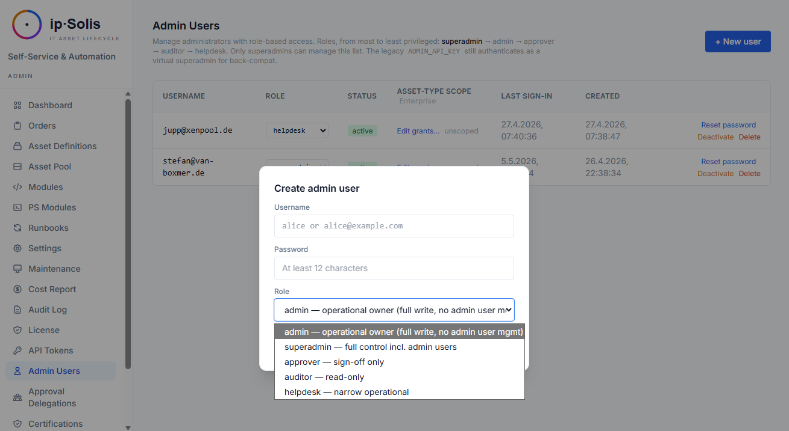

# Sicherheit

ip·Solis ist für Umgebungen konzipiert, in denen IT-Governance entscheidend ist. Die Zugriffskontrolle ist mehrschichtig aufgebaut: Eine fünfstufige Admin-Rollenhierarchie steuert, was jeder Operator sehen und tun darf, ACL-Berechtigungen je Asset-Typ schränken einzelne Admins auf bestimmte Asset-Typen ein, und die Durchsetzung der Funktionstrennung verhindert, dass dieselbe Person den Zugriff auf einen Asset-Typ sowohl konfiguriert als auch genehmigt.

---

## Admin-Rollenhierarchie

ip·Solis verfügt über fünf integrierte Admin-Rollen, geordnet von der höchsten zur niedrigsten Berechtigungsstufe:

| Rolle | Berechtigungen |
|---|---|
| `superadmin` | Vollzugriff. Verwaltet Admin-Benutzer, Lizenzen, API-Tokens, Seed-Export und die Ersteinrichtung. Selbstschutzmechanismen verhindern den Verlust des letzten aktiven Superadmins |
| `admin` | Operativer Zugriff: Asset-Typen, Runbooks, Pool-Verwaltung, Bestellungen, Konfiguration, Genehmigungsdelegationen, Modulverwaltung, Wartung |
| `approver` | Kann ausstehende Bestellungen genehmigen oder ablehnen. Nur-Lese-Zugriff auf Bestellungen und Asset-Typen |
| `auditor` | Nur-Lese-Zugriff auf Audit-Log, Kostenbericht, Leaver-Ereignisse, Zertifizierungen. Keine Schreiboperationen |
| `helpdesk` | Nur-Lese-Zugriff auf Bestellungen und den Asset-Pool. Kann Bestelldetails und Schritt-Logs einsehen |

### Ersteinrichtung

Wenn die Tabelle `admin_users` leer ist (frische Bereitstellung), fordert ip·Solis auf der Anmeldeseite automatisch zur Anlage des ersten Superadmin-Kontos auf. Nach Erstellung des Superadmins verschwindet diese Aufforderung.

### Passwortspeicherung

Admin-Passwörter werden mit PBKDF2-SHA256 und 600.000 Iterationen unter Verwendung der Python-Standardbibliothek gehasht — ohne externe Abhängigkeit von bcrypt oder passlib.

---

## Selbstständige Passwortänderung

Jeder Admin-Benutzer kann sein eigenes Passwort unter **My Account** (`/ui/my-account`) ändern. Das aktuelle Passwort ist als Lebendigkeitsnachweis erforderlich. Das neue Passwort muss sich vom aktuellen unterscheiden und mindestens 12 Zeichen lang sein.

Legacy-`X-Admin-Key`-Akteure (virtueller Superadmin über die Umgebungsvariable) können diese Seite nicht nutzen und werden zur Rotation über `.env` verwiesen.

Jede Passwortänderung erzeugt einen Audit-Eintrag (`password_changed_self`) ohne Wertinhalt — die Tatsache der Änderung wird festgehalten, aber weder das alte noch das neue Passwort erscheinen im Audit-Trail.

---

## Passwortrichtlinie

Operatoren können eine Mindestpasswortlänge und eine Kontosperrungsrichtlinie für Admin-Konten erzwingen:

| Konfigurationsschlüssel | Beschreibung |
|---|---|
| `security.password_min_length` | Mindestpasswortlänge (durchgesetzt beim Setzen und Ändern) |
| `security.lockout_attempts` | Fehlgeschlagene Anmeldeversuche bis zur Sperrung |
| `security.lockout_duration_minutes` | Wie lange ein Konto nach zu vielen Fehlversuchen gesperrt bleibt |

Konfigurieren unter **Admin → Settings → Security**.

---

## ACL-Berechtigungen je Asset-Typ

Schränken Sie einzelne `admin`-Benutzer auf eine Teilmenge von Asset-Typen ein. Sobald ein Admin mindestens eine ACL-Berechtigung besitzt, wechselt er in den „eingeschränkten Modus":

- Die Asset-Typ-Liste in der Admin-Oberfläche zeigt nur die ihm zugewiesenen Typen
- `PUT`-, `DELETE`- und Klon-Operationen auf Typen außerhalb des Geltungsbereichs liefern `404` zurück (gleiche Form wie bei einer fehlenden ID — die Existenz von Typen anderer Teams wird nicht preisgegeben)
- Die API verhält sich identisch zur Oberfläche — die Einschränkung wird auf Routenebene durchgesetzt, nicht nur in Templates

Keine Berechtigungen = rückwärtskompatibles „Alles sehen"-Verhalten, sodass Installationen mit nur einem Team nicht betroffen sind.

**Automatische Berechtigung beim Erstellen**: Wenn ein eingeschränkter Admin einen neuen Asset-Typ erstellt, wird die Berechtigung automatisch hinzugefügt, damit er die Sichtbarkeit auf seine eigene Erstellung nicht verliert.

`superadmin`, `approver`, `auditor` und `helpdesk` umgehen die Einschränkung stets — nur die Rolle `admin` unterliegt ACL-Berechtigungen.

Verwalten Sie Berechtigungen unter **Admin → Users → [user] → Asset Type Access**.

---

## Funktionstrennung

Ein Admin, der einen Asset-Typ konfiguriert hat, kann Zugriffsanfragen dagegen nicht auch genehmigen. Dies verhindert, dass eine einzelne Person sowohl festlegt, was gewährt wird, als auch entscheidet, wer es erhält.

**Erkennung**: Bei jeder Genehmigungsaktion durchläuft ip·Solis das Audit-Log nach Einträgen, in denen der Genehmiger (abgeglichen über E-Mail, Local-Part oder Admin-Benutzername) den betreffenden Asset-Typ erstellt, aktualisiert oder geklont hat.

**Durchsetzung**: Wird eine Übereinstimmung gefunden, liefert die Genehmigungsanfrage `HTTP 409` zurück, wobei der ursprüngliche Konfigurations-Audit-Eintrag zitiert wird. Der Genehmigungseintrag bleibt `pending`, sodass ein anderer Genehmiger entscheiden kann.

**Ablehnungen**: Die Prüfung greift nur bei Genehmigungsaktionen. Das Ablehnen eines selbst konfigurierten Asset-Typs ist stets zulässig.

---

## Bearer-Token-Authentifizierung

Benannte API-Tokens ersetzen den globalen `X-Admin-Key` durch individuell verwaltete, widerrufbare und ablaufende Anmeldedaten. Vollständige Dokumentation siehe [Integrations → API Tokens](./integrations#api-tokens).

### Rollenbindung

API-Tokens können zusätzlich zu ihren Scopes mit einer bestimmten Rolle ausgegeben werden. Ein Token mit `admin:*`-Scope, aber `auditor`-Rolle wird von Schreiboperationen ausgeschlossen — die restriktivere Festlegung aus Scope und Rolle setzt sich durch.

**Ausgabe-Schutz**: Ein Ersteller kann nur Tokens auf oder unter seiner eigenen Rollenstufe ausgeben. Ein `admin` kann kein `superadmin`-Token erstellen.

---

## Legacy X-Admin-Key

Die ursprüngliche Umgebungsvariable `ADMIN_API_KEY` authentifiziert weiterhin als virtueller Superadmin über den Request-Header `X-Admin-Key`. Dies stellt sicher, dass bestehende Automatisierungen und Integrationen nach dem Upgrade auf RBAC weiterhin funktionieren. Es wird empfohlen, für neue Integrationen auf benannte API-Tokens umzustellen.

Der Legacy-Schlüssel wird im Audit-Trail als `admin:legacy_key` zugeordnet, sodass er auch ohne benanntes Konto auditierbar bleibt.

---

## Portal-Sicherheit

Das Self-Service-Portal verfügt über ein eigenes Sicherheitsmodell, getrennt von der Admin-Oberfläche:

- **SSO-Durchsetzung** — wenn der Entra-ID-Modus aktiviert ist, werden nicht authentifizierte Anfragen zur Microsoft-Anmeldung umgeleitet
- **Serverseitige Identität** — alle Portal-Mutationen verwenden die serverseitig verifizierte Entra-Identität, niemals einen vom Client übermittelten Wert
- **Leaver-Blockierung** — Benutzer, die über HR-Webhook oder SCIM als Leaver markiert sind, werden sofort an der Aufgabe neuer Bestellungen gehindert, auch wenn ihr Entra-Konto noch aktiv ist
- **Delegationsintegrität** — ein Benutzer kann eine Delegation nur für seine eigenen Genehmigungen konfigurieren; der Server setzt dies unabhängig davon durch, was der Client übermittelt
- **Signierte Genehmigungstoken** — Ein-Klick-Genehmigungs-/Ablehnungslinks verwenden zeitlich begrenzte, HMAC-signierte Tokens; sie können weder gefälscht noch wiederverwendet werden

---

## Webhook-Sicherheit

Alle eingehenden Webhooks (ServiceNow, HR-Leaver) validieren `X-Hub-Signature-256`-HMAC-SHA256-Signaturen unter Verwendung von `WEBHOOK_SECRET_TOKEN`. Die Validierung nutzt `hmac.compare_digest`, um Timing-Angriffe zu verhindern.

Der HR-Leaver-Webhook akzeptiert zusätzlich scoped Bearer-Tokens (Scope `hr:leaver`) als bevorzugte Alternative zu HMAC, sodass das Secret unabhängig je Integration rotiert werden kann.

---

## Hinweise zur Deployment-Sicherheit

- Alle Secrets (AD-Bind-Passwort, SMTP-Passwort, Entra-Client-Secret, vSphere-/XenServer-/SCCM-Anmeldedaten) werden in der Tabelle `app_config` gespeichert und niemals in `.env` geschrieben oder in Images eingebacken
- `.env` enthält nur Infrastruktur-Secrets (Datenbank-URL, Redis-URL, Admin-API-Key, Webhook-Token) — das Minimum, das zum Starten der Container erforderlich ist
- Als Secret typisierte `app_config`-Einträge werden niemals in Vorher/Nachher-Diffs des Audit-Logs aufgenommen
- Referenzen auf externe Secret-Backends (Vault, CyberArk, Azure KV, AWS SM, Conjur) ermöglichen es, alle `app_config`-Secrets durch Vault-Referenzen zu ersetzen — keine Klartext-Anmeldedaten im Ruhezustand
- Der Nginx-Reverse-Proxy terminiert TLS, bevor der Datenverkehr FastAPI erreicht; einfaches HTTP wird nur im internen Docker-Netzwerk verwendet
