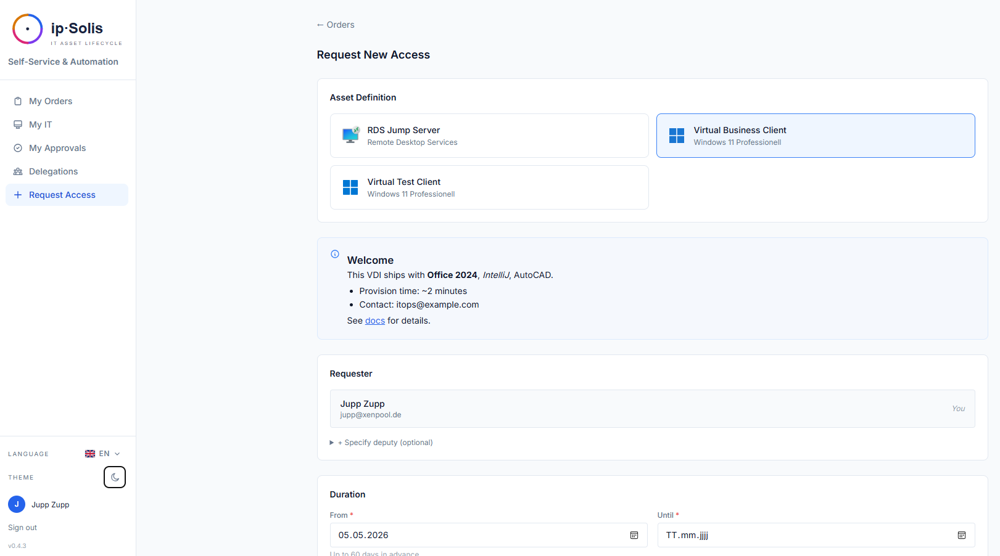
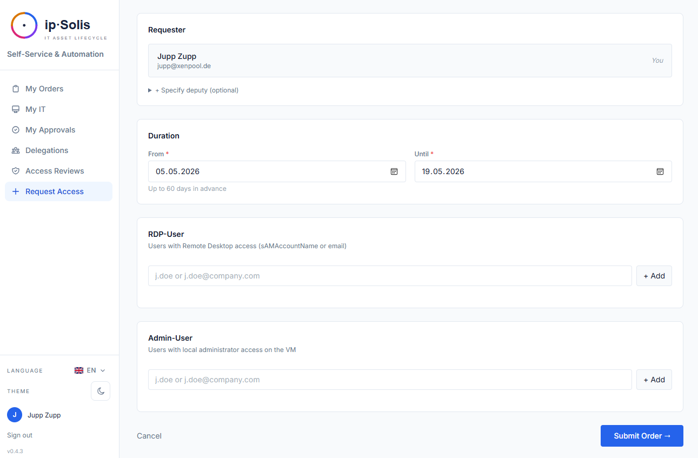
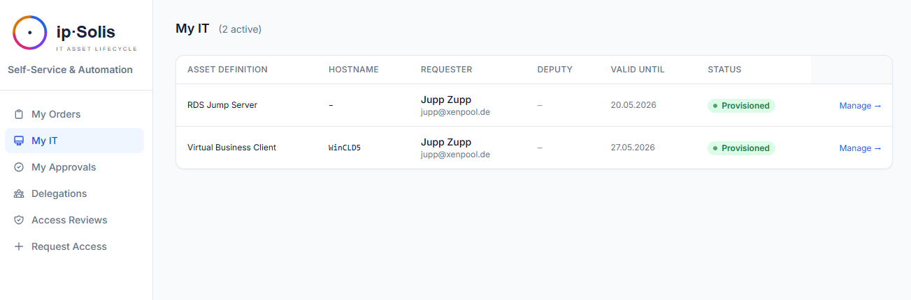

# Self-Service-Portal

Das Self-Service-Portal ermöglicht es Mitarbeitenden, IT-Assets anzufordern, den Bestellstatus zu verfolgen, aktive Ressourcen zu verlängern oder zurückzugeben und ihren digitalen Arbeitsplatz zu verwalten — ohne ein Helpdesk-Ticket zu eröffnen. Das Portal ist unter `/portal` erreichbar und vollständig von der Admin-UI getrennt.

---

## Authentifizierung

Das Portal unterstützt drei Authentifizierungsmodi, die unter **Admin → Settings → Entra ID** konfiguriert werden:

| Modus | Verhalten |
|---|---|
| `disabled` | Das Portal ist offen; alle Benutzer teilen sich eine anonyme Identität. Geeignet für Tests oder rein interne Bereitstellungen ohne SSO |
| `entra_only` | Entra ID (Azure AD) SSO erforderlich. Benutzer melden sich mit ihrem Microsoft-365-Konto an |
| `entra_with_onprem` | Entra ID SSO plus eine lokale LDAP-Mitgliedschaftsprüfung. Der Benutzer muss sowohl in Entra authentifiziert als auch in der konfigurierten AD-Gruppe vorhanden sein |

Wenn SSO aktiviert ist, wird die E-Mail-Adresse des Benutzers automatisch aufgelöst. Die Vorgesetzten-Suche für das Genehmigungs-Routing nutzt dieselbe AD-Verbindung.

---

## Ein Asset anfordern

### Den Katalog durchsuchen

Der Katalog (`/portal/orders/new`) zeigt alle aktiven Asset-Definitionen, die der angemeldete Benutzer anfordern darf. Jede Karte zeigt den Asset-Namen, die Beschreibung, die Kategorie und — sofern konfiguriert — die voraussichtlichen monatlichen Kosten.

**Suche und Filter** erscheinen automatisch bei Katalogen mit mehr als sechs Definitionen. Die Suche berücksichtigt Name, Beschreibung und Hilfetext; das Kategorie-Dropdown filtert nach der Kategorie des Asset-Typs. Beides funktioniert clientseitig ohne Neuladen der Seite.

**Hilfetext** — Administratoren können jeder Asset-Definition eine in Markdown formatierte Beschreibung hinzufügen. Wenn ein Anforderer einen Typ auswählt, erscheint der gerenderte Hilfetext oberhalb der Attributfelder. Verwenden Sie diesen, um vorinstallierte Software, Berechtigungsanforderungen, die voraussichtliche Bereitstellungszeit und Support-Kontakte zu dokumentieren.

### Berechtigte Anforderer

Asset-Typen können auf bestimmte Active-Directory-Gruppen beschränkt werden. Benutzer, die nicht Mitglied der konfigurierten Gruppe sind, sehen die Definition nicht im Katalog.

### Das Bestellformular ausfüllen

Nach der Auswahl eines Asset-Typs füllt der Anforderer alle vom Benutzer bereitzustellenden Attribute aus (z. B. Hostname-Präfix, Verwendungszweck, Laufzeit). Felder, die mit einer **Datenklassifizierung** (`PII`, `PHI` oder `PCI`) gekennzeichnet sind, zeigen ein Warnsymbol an, damit Anforderer sich vor dem Absenden der Sensibilität bewusst sind.

### Kontingent pro Benutzer

Wenn für den Asset-Typ ein `max_per_user`-Limit festgelegt ist, gibt das Portal einen Fehler zurück, falls der Benutzer bereits so viele aktive Instanzen dieses Typs besitzt. Die Prüfung umfasst alle nicht-terminalen Zustände (pending, processing, provisioned usw.), sodass Benutzer das Limit nicht durch gestapelte, zukünftig datierte Bestellungen umgehen können.

### Kostenprognose pro Bestellung

Wenn für einen Asset-Typ `monthly_cost` konfiguriert ist, zeigt das Bestellformular die voraussichtlichen Gesamtkosten (`monthly_cost × months_requested`) an, bevor der Benutzer absendet. Diese erscheinen in der Karte **Access & Duration**.

---

## Genehmigungsworkflow

Bestellungen, die eine Genehmigung erfordern, gelangen in den Zustand `pending_approval`. Das Portal zeigt den aktuellen Genehmigungsstatus auf der Detailseite der Bestellung an. Die Bereitstellung beginnt erst, wenn alle erforderlichen Genehmigungen eingeholt wurden (vorbehaltlich des Quorums — siehe unten).

### Genehmigungstypen

ip·Solis unterstützt drei sich ergänzende Genehmigungsmechanismen, die bei jeder Asset-Definition kombiniert werden können. Alle aktiven Mechanismen steuern Genehmiger zur selben Bestellung bei; das System dedupliziert anhand der E-Mail-Adresse, sodass eine Person, die über mehrere Pfade qualifiziert ist, nur eine Anfrage erhält.

#### Vorgesetztengenehmigung

Wird pro Asset-Typ über **Requires Manager Approval** aktiviert. Wenn eine Bestellung abgesendet wird, ermittelt ip·Solis den Vorgesetzten des Anforderers in Echtzeit im Active Directory. Ist für das Konto kein Vorgesetzter konfiguriert, wird die Bestellung mit einer klaren Fehlermeldung blockiert — der Benutzer muss sich an die IT wenden, um einen Vorgesetzten zuweisen zu lassen, bevor er diesen Asset-Typ anfordern kann.

Die E-Mail-Adresse und der Anzeigename des Vorgesetzten werden zum Zeitpunkt der Bestellerstellung aus dem AD übernommen. Hat der Vorgesetzte ein aktives Vertretungsfenster konfiguriert, wird die Genehmigungsanfrage automatisch an die Stellvertretung umgeleitet.

#### Genehmigung durch den Anwendungseigentümer

Wird pro Asset-Typ über **Requires Application Owner Approval** aktiviert. Eigentümer sind eine feste Liste von E-Mail-Adressen, die bei der Asset-Definition unter **Access & Approval → Application Owners** konfiguriert wird. Jeder Eigentümer in der Liste erhält eine Genehmigungsanfrage; die Quorum-Einstellung bestimmt, wie viele Antworten erforderlich sind.

#### Bedingte Genehmigungsregeln

Regeln fügen dynamisch Genehmiger anhand des Inhalts jeder Bestellung hinzu. Sie greifen zusätzlich zu (und werden zusammengeführt mit) Vorgesetzten- und Eigentümergenehmigungen — eine einzelne Bestellung kann alle drei auslösen. Regeln werden pro Asset-Typ unter **Access & Approval → Conditional Approval Rules** konfiguriert.

Eine vollständige Referenz finden Sie im eigenen Abschnitt [Bedingte Genehmigungsregeln](#bedingte-genehmigungsregeln) weiter unten.

---

### Zustellung der Genehmigung

Genehmiger erhalten eine E-Mail mit Ein-Klick-Links für **Approve** und **Decline**. Der Link enthält ein signiertes Token — eine Portal-Anmeldung ist nicht erforderlich. Genehmiger handeln direkt aus ihrem E-Mail-Client heraus.

**Microsoft-Teams-Karten** — wenn die Teams-Integration aktiviert ist, wird dieselbe Genehmigungs-/Ablehnungs-Aufforderung zusätzlich als Adaptive Card an den konfigurierten Teams-Kanal zugestellt.

**Erinnerungen** — wenn ein Genehmiger nach dem konfigurierten Intervall (Standard: 24 Stunden) nicht reagiert hat, sendet das System die Benachrichtigung erneut. Vor einer Eskalation werden bis zu drei Erinnerungen versendet.

**Eskalation** — nachdem die Erinnerungen aufgebraucht sind, werden die konfigurierten Eskalationskontakte benachrichtigt und erhalten ihren eigenen Ein-Klick-Link.

**Automatische Ablehnung** — ausstehende Genehmigungen, die das konfigurierte Inaktivitätsfenster überschreiten, werden von einer täglichen Hintergrundaufgabe automatisch abgelehnt.

---

### Quorum (N von M)

Die Einstellung **Min. Approvals Required** bei einem Asset-Typ steuert, wie viele der gesammelten Genehmiger zustimmen müssen, bevor die Bereitstellung beginnt. Wird sie leer gelassen oder auf `0` gesetzt, müssen *alle* Genehmiger zustimmen. Wird sie auf `1` gesetzt, hebt die erste Genehmigung die Bestellung frei, unabhängig davon, wie viele andere Genehmiger benachrichtigt wurden.

Bedingte Regeln können ein eigenes regelspezifisches Quorum definieren, das nur für die von dieser Regel beigesteuerten Genehmiger gilt, unabhängig von der Einstellung auf Asset-Typ-Ebene (siehe unten).

---

### Genehmigungshinweis im Portal

Wenn für einen Asset-Typ irgendeine Genehmigung konfiguriert ist, zeigt das Anforderungsformular eine bernsteinfarbene Hinweisleiste an, damit Benutzer vor dem Absenden wissen, dass ihre Bestellung eine Genehmigung erfordert. Die Leiste passt ihre Meldung an:

- *Nur Vorgesetzter* — "Diese Anfrage erfordert die Genehmigung durch Ihren Vorgesetzten, bevor die Bereitstellung beginnt."
- *Nur Anwendungseigentümer* — "Diese Anfrage erfordert die Genehmigung durch einen Anwendungseigentümer, bevor die Bereitstellung beginnt."
- *Beide* — "Diese Anfrage erfordert die Genehmigung durch Ihren Vorgesetzten und einen Anwendungseigentümer, bevor die Bereitstellung beginnt."

Bedingte Regeln erscheinen nicht im Portal-Hinweis, da sie bedingt auslösen — je nachdem, was der Benutzer eingibt, kann er sie auslösen oder nicht.

---

## Bedingte Genehmigungsregeln

Bedingte Regeln ermöglichen es Ihnen, Genehmiger anhand der Attribute jeder einzelnen Bestellung hinzuzufügen. Sie werden zum Zeitpunkt der Bestellerstellung ausgewertet; jede Regel, deren Bedingung zutrifft, steuert ihre aufgeführten Genehmiger bei. Mehrere Regeln können auf eine einzelne Bestellung zutreffen.

### Regelstruktur

Jede Regel hat:

| Feld | Beschreibung |
|---|---|
| **Name** | Menschenlesbare Bezeichnung, die im Audit-Log und in Genehmigungs-E-Mails angezeigt wird |
| **Condition** | Ein Baum von Bedingungen, die zutreffen müssen, damit diese Regel auslöst |
| **Approvers** | Eine oder mehrere E-Mail-Adressen (müssen gültige Domänenkonten sein) |
| **Quorum** | Optionale N-von-M-Überschreibung nur für die Genehmiger dieser Regel. Leer lassen, um in das Quorum auf Asset-Typ-Ebene einzufließen |

### Bedingungsfelder

Bedingungen vergleichen ein benanntes Feld aus dem Bestellkontext mit einem Wert.

**Integrierte Felder** — immer verfügbar, unabhängig von der Attributkonfiguration des Asset-Typs:

| Feld | Typ | Beschreibung |
|---|---|---|
| `duration_days` | number | Angeforderte Laufzeit in Tagen (`requested_until` − `requested_from`) |
| `monthly_cost` | number | Die für den Asset-Typ konfigurierten monatlichen Kosten |
| `has_pii` | boolean | `true`, wenn ein Attribut des Asset-Typs als PII klassifiziert ist |
| `has_phi` | boolean | `true`, wenn ein Attribut als PHI klassifiziert ist |
| `has_pci` | boolean | `true`, wenn ein Attribut als PCI klassifiziert ist |
| `requester_department` | string | Über AD aufgelöste Abteilung des anfordernden Benutzers |

**Benutzerdefinierte Attributfelder** — jedes auf der Registerkarte **Attributes** des Asset-Typs definierte Attribut ist als `attr.<key>` verfügbar, wobei `<key>` der interne Schlüsselname des Attributs ist. Ein Attribut mit dem Schlüssel `project_code` wird beispielsweise als `attr.project_code` referenziert. Der Wert ergibt sich aus dem, was der Anforderer bei der Bestellung eingegeben hat.

### Operatoren

| Operator | Gilt für | Verhalten |
|---|---|---|
| `>` `>=` `<` `<=` | Zahlen | Numerischer Vergleich. Nicht-numerische Werte treffen nie zu |
| `==` | Beliebig | Groß-/Kleinschreibung-unabhängige String-Gleichheit. Booleans treffen sowohl auf `true`/`false` als auch auf `True`/`False` zu |
| `contains` | Strings, Listen | Groß-/Kleinschreibung-unabhängige Teilstring-Übereinstimmung. Bei listenwertigen Attributen wird geprüft, ob ein Element den Wert enthält |

### Verknüpfungslogik

Bedingungen können mithilfe von `ALL (AND)`-, `ANY (OR)`- und `NOT`-Gruppen beliebig tief verschachtelt werden (bis zu 8 Ebenen). Die Wurzel jeder Regel ist eine `ALL`- oder `ANY`-Gruppe.

- **ALL (AND)** — jede Bedingung in der Gruppe muss zutreffen. Eine leere Gruppe trifft immer zu.
- **ANY (OR)** — mindestens eine Bedingung muss zutreffen. Eine leere Gruppe trifft nie zu.
- **NOT** — invertiert eine einzelne verschachtelte Bedingung.

Gruppen können in andere Gruppen verschachtelt werden. Zum Beispiel: *(duration > 30 AND project_code contains "EU-") OR has_pii == true*.

### Genehmiger

Jede Regel listet eine oder mehrere E-Mail-Adressen von Genehmigern auf. Genehmiger müssen **gültige Domänenkonten** sein — ip·Solis schlägt jede E-Mail-Adresse im Active Directory nach, wenn die Regel auslöst. Kann ein konfigurierter Genehmiger nicht aufgelöst werden, wird die Bestellung mit einem Fehler blockiert, bis die Regel von einem Administrator korrigiert wird.

Dies spiegelt das Verhalten der Vorgesetztengenehmigung wider: Das System weigert sich, einen Genehmigungsdatensatz für eine nicht auflösbare Identität anzulegen. In allen Benachrichtigungen wird der AD-kanonische Anzeigename verwendet, unabhängig davon, welcher Name bei der Konfiguration der Regel eingegeben wurde.

### Deduplizierung von Genehmigern

Dieselbe E-Mail-Adresse wird für dieselbe Bestellung nie zweimal benachrichtigt, selbst wenn sie in mehreren Regeln vorkommt oder sich mit dem Vorgesetzten oder Anwendungseigentümer überschneidet. Die Quorum-Einstellung der ersten zutreffenden Regel gewinnt, wenn dieselbe E-Mail-Adresse in mehr als einer Regel vorkommt — halten Sie die Genehmigerlisten regelübergreifend disjunkt, wenn das regelspezifische Quorum wichtig ist.

### Regelspezifisches Quorum

Das Festlegen von **Quorum** bei einer Regel erstellt eine eigenständige Quorum-Gruppe für die Genehmiger dieser Regel, getrennt von der Einstellung `Min. Approvals Required` auf Asset-Typ-Ebene. Zum Beispiel:

- Asset-Typ: mindestens 1 von allen Genehmigern (Vorgesetzter + Eigentümer + Regelgenehmiger zusammen)
- Regel "CISO + DPO": Quorum 1 — entweder CISO oder DPO genügt für die Gruppe dieser Regel

Beide Quoren müssen erfüllt sein, bevor die Bereitstellung beginnt.

### SoD-Ausnahme

Administratoren, die zugleich als Regelgenehmiger konfiguriert sind, würden normalerweise durch die Prüfung der Funktionstrennung (Separation of Duties) blockiert (ein Administrator kann seine eigenen Konfigurationsentscheidungen nicht genehmigen). Durch Aktivieren von **SoD exempt** bei einer Regel wird diese Prüfung für die Genehmiger dieser Regel umgangen — verwenden Sie dies für feste Compliance-Beauftragte, die zufällig eine Admin-Rolle innehaben.

### Beispiele

**Verlängerung über 30 Tage in einem EU-Projekt erfordert CISO und DPO (einer von beiden genügt):**

> Regel: *EU project + long duration needs CISO+DPO*
> Bedingung: `ALL` — `duration_days > 30` AND `attr.project_code contains "EU-"`
> Genehmiger: `ciso@example.com`, `dpo@example.com`
> Quorum: 1

**Jede Bestellung, die personenbezogene Daten betrifft, benachrichtigt das Datenschutzteam:**

> Regel: *Personal data tag*
> Bedingung: `has_pii == true`
> Genehmiger: `privacy@example.com`
> Quorum: (leer — fließt in das Asset-Typ-Quorum ein)

**Hochpreisige Bestellungen aus der Finanzabteilung benötigen die Freigabe des CFO:**

> Regel: *Finance high cost*
> Bedingung: `ANY` — `monthly_cost >= 500` AND `requester_department == Finance`
> Genehmiger: `cfo@example.com`
> Quorum: 1

---

## Mein-IT-Dashboard

Die Ansicht **My IT** (`/portal/my-it`) zeigt alle aktiven Assets, die dem angemeldeten Benutzer zugewiesen sind.

Von hier aus können Benutzer:

- **Verlängern** — eine Anfrage zur Verlängerung des Ablaufdatums eines aktiven Assets stellen (sofern konfiguriert, genehmigungspflichtig)
- **Ändern** — vom Benutzer bereitgestellte Attribute einer bestehenden Bestellung ändern (erneut genehmigungspflichtig, wenn beim Asset-Typ `reapproval_on_modify` aktiviert ist)
- **Zurückgeben** — die Deprovisionierung auslösen und das Asset zurück in den Pool freigeben
- **Stornieren** — eine ausstehende oder geplante Bestellung stornieren, bevor sie verarbeitet wird

---

## Bestellung im Auftrag (Owner Ordering)

Die Bestellung im Auftrag ermöglicht es einem Benutzer, eine Bestellung im Namen einer anderen Person aufzugeben. Der Anforderer wählt im Bestellformular den **Owner** aus (die Person, *für* die das Asset bestellt wird). Die resultierende Bestellung wird dem Owner zugeordnet, nicht dem absendenden Benutzer, sodass AD-Gruppenmitgliedschaft, Genehmigungen und Audit-Zeilen alle auf die richtige Person verweisen.

Anwendungsfälle: Ein IT-Administrator bestellt eine VDI für eine neue Mitarbeiterin vor ihrem ersten Arbeitstag; ein Vorgesetzter bestellt im Auftrag eines Teammitglieds, das nicht auf das Portal zugreifen kann.

---

## Geplante Bestellungen

Bestellungen können in die Zukunft datiert werden. Eine geplante Bestellung reserviert das Asset sofort (damit niemand anderes es beanspruchen kann), löst die Bereitstellung jedoch erst aus, wenn das geplante Startdatum erreicht ist. Die Celery-Beat-Aufgabe `check-scheduled-orders` läuft stündlich, um bereite Bestellungen auszulösen.

Geplante Bestellungen erscheinen in My IT mit einem `scheduled`-Statussymbol und dem Ziel-Startdatum.

---

## Genehmigungsvertretung

**Vom Administrator konfigurierte Vertretung** — ein Administrator kann für jeden Genehmiger ein Vertretungsfenster konfigurieren (z. B. "Stefan ist vom 1.–15. August im Urlaub; leite seine Genehmigungen an Jupp weiter"). Neue Bestellungen während des Fensters adressieren automatisch die Vertretung. Der ursprüngliche Verantwortliche wird im Audit-Trail erfasst.

**Self-Service-Vertretung** — Vorgesetzte können ihre eigenen Vertretungsfenster direkt im Portal unter `/portal/delegations` konfigurieren, ohne den Weg über einen Administrator. Der Server stellt sicher, dass ein Benutzer eine Vertretung nur für seine eigenen Genehmigungen konfigurieren kann.

---

## Zugriffszertifizierungen *(Pro)*

Wenn eine Zugriffszertifizierungskampagne aktiv ist und der angemeldete Benutzer ein Prüfer ist, erscheint im Portal eine Benachrichtigung, die ihn auf `/portal/certifications` verweist. Diese Seite zeigt alle dem Benutzer zugewiesenen, ausstehenden Prüfzeilen mit Ein-Klick-Optionen **Confirm** (Benutzer behält den Zugriff) oder **Revoke** (Zugriff wird sofort entzogen) für jede Zeile.

---

## Sperrung von Austretenden (Leaver Blocking)

Wird ein Benutzer als Austretender gekennzeichnet (über einen HR-Webhook oder SCIM), wird er sofort daran gehindert, neue Bestellungen aufzugeben. Das Portal zeigt eine klare Meldung an, die erläutert, dass das Konto gekennzeichnet wurde, und verweist den Benutzer an die IT, falls dies fälschlicherweise geschehen ist.

---

## Mehrsprachige Unterstützung

Die Portal-UI ist in **Englisch, Deutsch, Französisch, Spanisch und Italienisch** verfügbar. Die aktive Sprache wird aus dem `Accept-Language`-Header des Browsers erkannt und kann über eine Sprachauswahl überschrieben werden. Alle Beschriftungen, Validierungsmeldungen, E-Mail-Vorlagen und Leerzustände sind lokalisiert.
